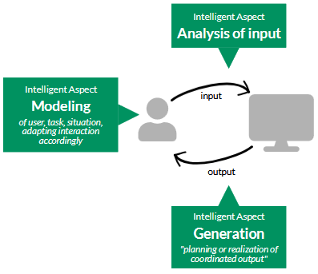

<details><summary>Drop Down Menu</summary>

IUI = Intelligent User Interfaces  
UI = User Interface
AI = Artificial Intelligence
HCI = Human-Computer Interaction

- [x] Markdown-Notizen
- [ ] Weitere Notizen
- [ ] Noch mehr Notizen

- Punkt 1
- Punkt 2
- Punkt 3

1. Erster Punkt
2. Zweiter Punkt
3. Dritter Punkt

**fett**

_kursiv_

`inline code`

> Blockquote


[Google](https://www.google.com)

---

\*Это звездочка\*

```python
def hello_world():
		print("Hello, World!")
```

</details>

## 1.[Intro](./lecture/iui_lecture_01_intro.pdf)

<details><summary>Describe concrete examples of IUI</summary>

- Text suggestions (e.g. Gmail Smart Compose)
- Chatbots
- Semantic image editing: editing images by describing the desired change in natural language (e.g. „Smart Portrait Filters“ in Adobe‘s Photoshop)
- Speech-based UIs: interactive systems that understand spoken language (e.g. Alexa)
- Biometric UIs: interactive systems that recognize you (e.g. phone unlock)
- UIs for co-creation: UIs where both human + AI modify a digital artefact (e.g. DALL-E)
- Predictive input: improving or enabling input by modelling & predicting user behaviour
</details>

<details><summary>Explain the key motivations and goals of IUI</summary>

</details>

<details><summary>Explain (abstractly) what AI, models, and data are used for in IUI</summary>

</details>

<details><summary>Analyse a given IUI to interpret in your own words to what extent it includes aspects that make it a “tool” and/or aspects that make it an “agent”</summary>

</details>

----

<details><summary>What distinguishes a tool-style from an agent-style user interface? Name two characteristics of each, and place the following examples on the Tool–Agent spectrum: (1) Photoshop gaze-direction slider, (2) Amazon Alexa, (3) Gmail Smart Compose. Briefly justify each placement.</summary>

**Tool-style characteristics:**

- Interaction via direct manipulation with **immediate feedback**
- User has **full initiative** (nothing happens without user action)

**Agent-style characteristics:**

- System **hides the process** and presents results; may be **anthropomorphized**
- User **delegates** tasks; system acts independently

**Placements:**

- Photoshop slider → **Tool** — user directly drags a slider, full control, immediate visual feedback
- Gmail Smart Compose → **Middle (mixed initiative)** — reacts to user input but introduces its own words, slightly autonomous
- Amazon Alexa → **Agent** — has a name, mimics human speech, acts on behalf of the user, clearly anthropomorphized
</details>

<details><summary>What can computational methods / AI do in user interfaces?</summary>

| Category | Role | Examples | What It Means in Practice |
|---|---|---|---|
| ⌨️ **Input** | **Improve doing** things with a UI | Text suggestions, touch predictions → improve speed, reduce errors | The user still does the task themselves, but AI makes it faster, easier, or less error-prone |
| 🎙️ **Modalities** | Enable **new ways of doing** things in a UI | Touch, gestures, natural language, voice | AI unlocks interaction channels that weren't usable before (e.g. speaking instead of typing) |
| 🔨 **Capabilities** | Enable users **to do new things** | Write emails in a different language | AI expands what a user is able to achieve — tasks that were previously impossible become possible |
| 🖥️ **Output** | Inform what to **show** when and how | Redirected walking, recommendations | AI decides what content or feedback is shown to the user, personalizing or adapting the display |
| ⚙️ **Automation** | Make decisions and/or **act for users** | AI system placing elements in a game level editor, not just the level designer | AI takes over (parts of) the task — the user delegates instead of doing every step themselves |
</details>

<details><summary>DIRA</summary>

**DIRA** is a conceptual model of UI


| Element | Role | Examples | Design Concerns | What It Means in Practice |
|---|---|---|---|---|
| **D**evices | Sense the user and display representations | Buttons, mice, touchscreens, speakers | Expressiveness, sensing range, latency | How accurately does the device capture input? Is there a noticeable delay? |
| **I**nteraction Techniques | Map what is sensed by devices to operations on assemblies | Pointing, selection, drag & drop, C-D ratio, movement gain | User performance: time, errors, accuracy, learnability | Does the user learn quickly? Do they make mistakes? Is the mapping intuitive? |
| **R**epresentations | Embody the user and the computer | Cursor, avatar, icons, text, desktop, virtual objects, audio, menu items | Semantic distance, metaphors, recognition, affordance | Is it clear to the user what an element does? (e.g. trash icon = delete) |
| **A**ssemblies | Organize representations and connect to the computer | File/icon layout on desktop, notification rules, menu item availability | Match with user tasks, discoverability, responsive design | Can the user easily find what they need? Does the UI adapt well across screen sizes? |

---

### DIRA Applied to IUI

For each element, we can ask: **what can AI achieve here?**

| Element | AI Application | Example |
|---|---|---|
| **D** | New sensor with AI-based signal processing | Google Soli — radar-based gesture recognition |
| **I** | Predicting finger/pen trajectory to reduce visual lag | Better stylus control on tablets without hardware upgrades |
| **R** | Learning representations from data to enable similarity search | Visual search in a web shop |
| **A** | Automatically distributing UI elements across multiple devices | Adaptive multi-device UI layout |

---

### Two Framings of IUI (related to DIRA)

| Framing | Direction | Key distinction | Example |
|---|---|---|---|
| **UIs for AI** | HCI → AI | the UI _wraps_ around the AI, making it accessible. Without the UI, the AI would be unusable for most people | Chat interface (ChatGPT) enables users to interact with a language model |
| **AI for UIs** | AI → HCI | the AI _enhances_ an existing UI. The UI existed before; AI just makes it smarter or more powerful | Smart Reply in Gmail improves how fast users can respond to emails |

---

### Exam Question

> Name the four elements of the DIRA model and give one example of how AI could enhance each element in an intelligent user interface.

**Model Answer:**
- **D (Devices):** AI processes raw sensor signals → e.g. Google Soli interprets radar data as gestures
- **I (Interaction Techniques):** AI predicts pen trajectory → reduces visual lag on touchscreens
- **R (Representations):** AI learns embeddings → enables image similarity search in a web shop
- **A (Assemblies):** AI distributes UI elements across devices → adaptive multi-device layout
</details>

<details><summary>Principle Areas of AI in IUIs</summary>

- **Modeling** of user, task, situation
- **Analysis of input**: Using AI to interpret and understand user input
- **Generation**: Using AI to create new content or responses

</details>

<details><summary>Definition of IUIs</summary>

### Official Definition (Wahlster & Maybury, 1998)

> Intelligent user interfaces (IUIs) are human-machine interfaces that aim to improve the **efficiency, effectiveness, and naturalness** of human-machine interaction by **representing, reasoning, and acting on models** of the user, domain, task, discourse, and media (e.g., graphics, natural language, gesture).

### Goals vs Approaches
 
| | Description | Keywords from definition |
|---|---|---|
| **Goals** | What IUIs aim to achieve | Efficiency, Effectiveness, Naturalness |
| **Approaches** | How IUIs achieve it | Models, Data — representing, reasoning, acting |

#### Goals explained
 
| Goal | Meaning |
|---|---|
| **Efficiency** | Users complete tasks faster, with less effort |
| **Effectiveness** | Users achieve their goals more accurately |
| **Naturalness** | Interaction feels intuitive, closer to human communication |
 
#### Approaches explained
 
| Approach | Meaning | Example |
|---|---|---|
| **Representing** | Building a model of the user, task, or context | Storing user preferences, tracking current task |
| **Reasoning** | Using the model to draw conclusions | Inferring what the user wants next |
| **Acting** | Using conclusions to adapt the UI or output | Showing a relevant suggestion, changing the layout |

#### What models can IUIs reason about?
 
| Model | What it captures |
|---|---|
| **User model** | Who is the user? What are their goals, habits, expertise? |
| **Domain model** | What is the subject area? (e.g. medical, legal, music) |
| **Task model** | What is the user trying to do right now? |
| **Discourse model** | What has been said/done so far in the interaction? |
| **Media model** | What modalities are available? (graphics, speech, gesture) |
</details>

<details><summary>Three Principle Areas of AI in IUIs</summary>


 
| Area | Description | Example |
|---|---|---|
| **Analysis of input** | AI interprets and understands what the user provides | Speech recognition, gesture detection, intent classification |
| **Modeling** | AI builds and maintains a model of user, task, situation — and adapts interaction accordingly | User profiling, context awareness, personalization |
| **Generation** | AI plans and produces coordinated output | Generating a response, adapting UI layout, producing a recommendation |
</details>

stopped at page 41