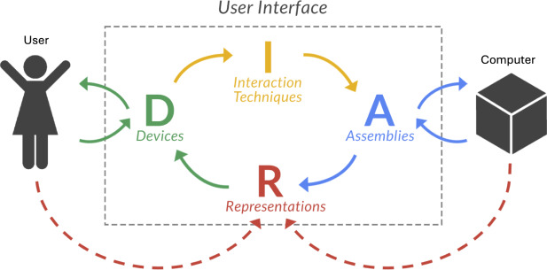
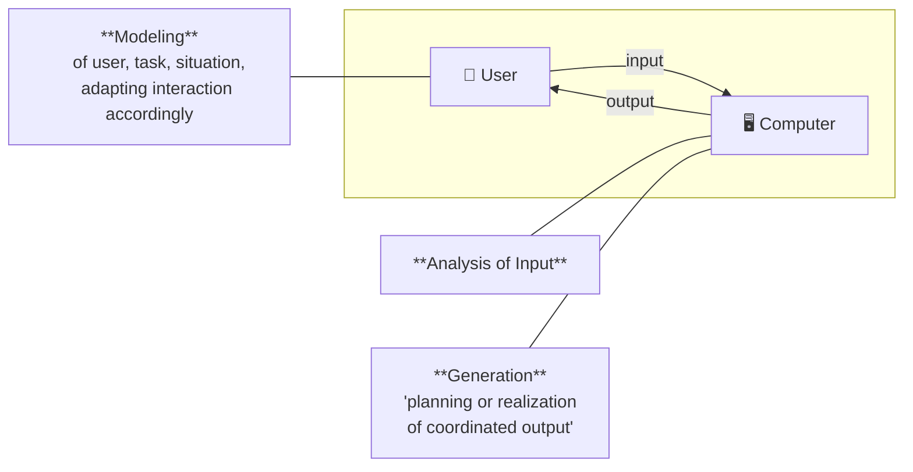
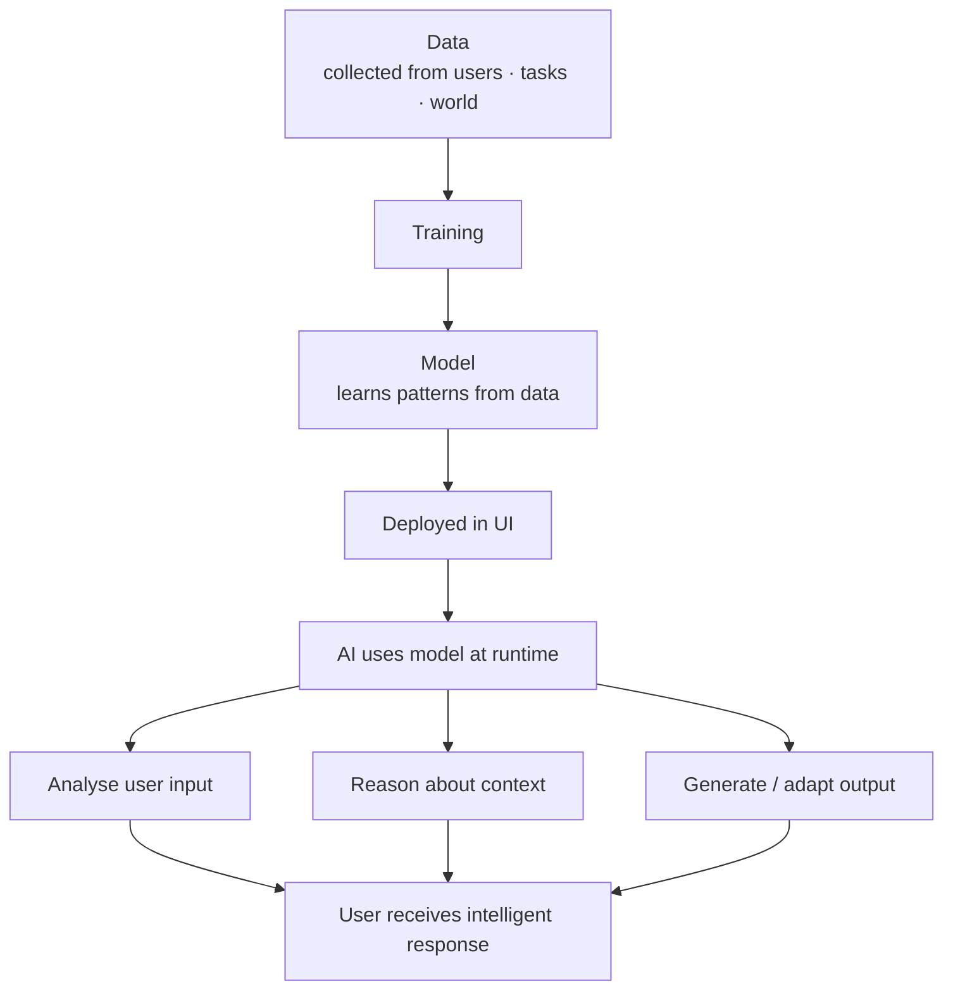
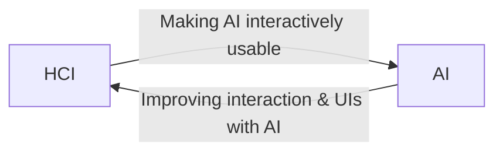
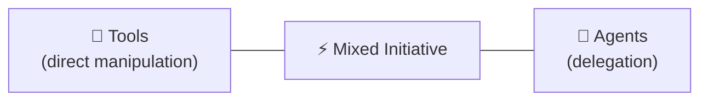
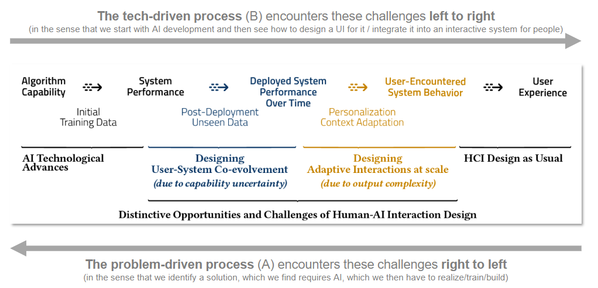
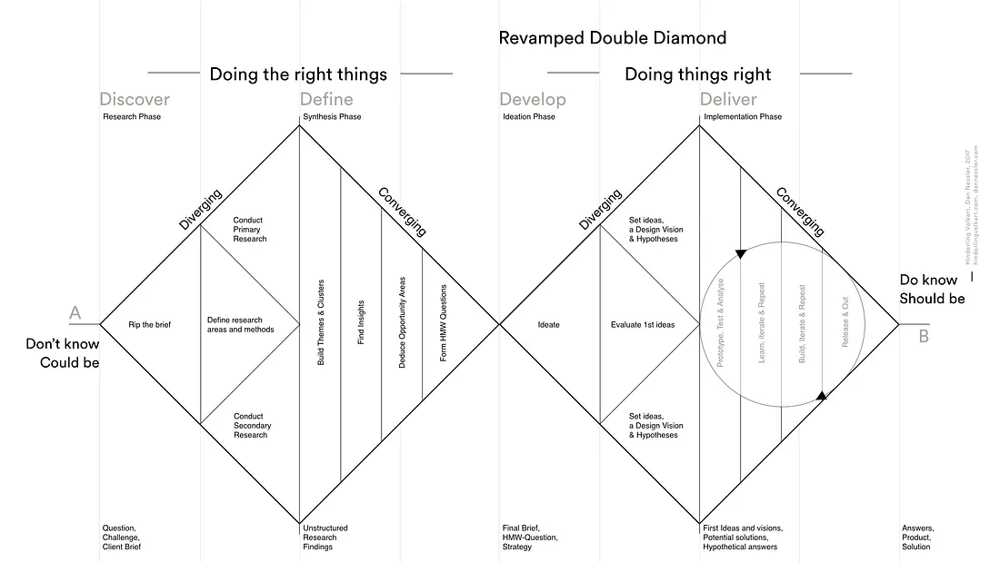
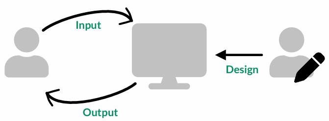

<details><summary>Help</summary>

- [x] This is a checklist
- [ ] This is an unchecked item
- [ ] This is another unchecked item

- One
- Two
- Three

1. One
2. Two
3. Three

**fett**

_kursiv_

`inline code`

> Blockquote




[Google](https://www.google.com)

---

\*Some text\*

```python
def hello_world():
		print("Hello, World!")
```

</details>

<details><summary>Shortcuts</summary>

IUI = Intelligent User Interfaces  
UI = User Interface  
AI = Artificial Intelligence

<!-- HCI = Human-Computer Interaction   -->
</details>

## 1.[Intro](./lecture/iui_lecture_01_intro.pdf)

<details><summary>Definition of IUIs</summary>

> Intelligent user interfaces (IUIs) are human-machine interfaces that aim to improve the **efficiency, effectiveness, and naturalness** of human-machine interaction by **representing, reasoning, and acting on models** of the user, domain, task, discourse, and media (e.g., graphics, natural language, gesture).
> (Wahlster & Maybury, 1998)

</details>

<details><summary>Explain approaches and goals of IUI</summary>
 
| | Description | Keywords from definition |
|---|---|---|
| **Goals** | What IUIs aim to achieve | Efficiency, Effectiveness, Naturalness |
| **Approaches** | How IUIs achieve it | Models, Data — representing, reasoning, acting |

#### Goals explained

| Goal              | Meaning                                                    |
| ----------------- | ---------------------------------------------------------- |
| **Efficiency**    | Users complete tasks faster, with less effort              |
| **Effectiveness** | Users achieve their goals more accurately                  |
| **Naturalness**   | Interaction feels intuitive, closer to human communication |

#### Approaches explained

| Approach         | Meaning                                        | Example                                            |
| ---------------- | ---------------------------------------------- | -------------------------------------------------- |
| **Representing** | Building a model of the user, task, or context | Storing user preferences, tracking current task    |
| **Reasoning**    | Using the model to draw conclusions            | Inferring what the user wants next                 |
| **Acting**       | Using conclusions to adapt the UI or output    | Showing a relevant suggestion, changing the layout |

#### What models can IUIs reason about?

| Model               | What it captures                                           |
| ------------------- | ---------------------------------------------------------- |
| **User model**      | Who is the user? What are their goals, habits, expertise?  |
| **Domain model**    | What is the subject area? (e.g. medical, legal, music)     |
| **Task model**      | What is the user trying to do right now?                   |
| **Discourse model** | What has been said/done so far in the interaction?         |
| **Media model**     | What modalities are available? (graphics, speech, gesture) |

</details>

<details><summary>Three Principle Areas of AI in IUIs</summary>



| Area                  | Description                                                                          | Concrete Example                                                                                                        |
| --------------------- | ------------------------------------------------------------------------------------ | ----------------------------------------------------------------------------------------------------------------------- |
| **Modeling**          | AI builds a model of the user, task, or situation and adapts interaction accordingly | Netflix user model — AI tracks watch history and infers preferences to personalise the UI and recommendations           |
| **Analysis of Input** | AI interprets and understands what the user provides                                 | Speech recognition in Alexa — AI analyses the audio signal and extracts the user's intent ("set a timer for 5 minutes") |
| **Generation**        | AI plans and produces coordinated output for the user                                | Gmail Smart Reply — AI generates short reply suggestions based on the received email                                    |

</details>

<details><summary>Describe concrete examples of IUI</summary>

- Text suggestions (e.g. Gmail Smart Compose)
- Chatbots (e.g. ChatGPT)
- Semantic image editing: editing images by describing the desired change in natural language (e.g. „Smart Portrait Filters“ in Adobe‘s Photoshop)
- Speech-based UIs: interactive systems that understand spoken language (e.g. Alexa)
- Biometric UIs: interactive systems that recognize you (e.g. phone unlock)
- UIs for co-creation: UIs where both human + AI modify a digital artefact (e.g. DALL-E)
- Predictive input: improving or enabling input by modelling & predicting user behaviour
</details>

<details><summary>Explain (abstractly) what AI, models, and data are used for in IUI</summary>

### The Big Picture

| Concept   | What it is                                                   | What it's used for in IUI                                       |
| --------- | ------------------------------------------------------------ | --------------------------------------------------------------- |
| **Data**  | Raw collected information (behaviour, text, images, signals) | Used to train models and understand user/context at runtime     |
| **Model** | A learned or hand-crafted representation of patterns in data | Used to reason about user, task, situation and make predictions |
| **AI**    | Algorithms that learn from data and make decisions           | Used to analyse input, adapt the UI, and generate output        |

### How They Work Together



### Concrete Roles in IUI

| Used for                     | Example                                                                 |
| ---------------------------- | ----------------------------------------------------------------------- |
| **Understanding user input** | Speech model trained on audio data → recognises spoken commands         |
| **Modelling the user**       | Interaction data → model learns preferences → UI adapts                 |
| **Generating output**        | Text data → language model → suggests email replies (Gmail Smart Reply) |
| **Improving interaction**    | Touch data → model predicts finger trajectory → reduces visual lag      |
| **Personalising content**    | Watch history → recommendation model → Netflix suggests films           |

### Key Takeaway

> In IUI, **data** trains **models**, and **AI** uses those models at runtime
> to make interaction more **efficient, effective, and natural** —
> by adapting to the user instead of requiring the user to adapt to the system.

</details>

<details><summary>DIRA</summary>

**DIRA** is a conceptual model of UI


| Element                    | Role                                                      | Examples                                                                 | Design Concerns                                           | What It Means in Practice                                                            |
| -------------------------- | --------------------------------------------------------- | ------------------------------------------------------------------------ | --------------------------------------------------------- | ------------------------------------------------------------------------------------ |
| **D**evices                | Sense the user and display representations                | Buttons, mice, touchscreens, speakers                                    | Expressiveness, sensing range, latency                    | How accurately does the device capture input? Is there a noticeable delay?           |
| **I**nteraction Techniques | Map what is sensed by devices to operations on assemblies | Pointing, selection, drag & drop, C-D ratio, movement gain               | User performance: time, errors, accuracy, learnability    | Does the user learn quickly? Do they make mistakes? Is the mapping intuitive?        |
| **R**epresentations        | Embody the user and the computer                          | Cursor, avatar, icons, text, desktop, virtual objects, audio, menu items | Semantic distance, metaphors, recognition, affordance     | Is it clear to the user what an element does? (e.g. trash icon = delete)             |
| **A**ssemblies             | Organize representations and connect to the computer      | File/icon layout on desktop, notification rules, menu item availability  | Match with user tasks, discoverability, responsive design | Can the user easily find what they need? Does the UI adapt well across screen sizes? |

---

### DIRA Applied to IUI

For each element, we can ask: **what can AI achieve here?**

| Element | AI Application                                                 | Example                                                    |
| ------- | -------------------------------------------------------------- | ---------------------------------------------------------- |
| **D**   | New sensor with AI-based signal processing                     | Google Soli — radar-based gesture recognition              |
| **I**   | Predicting finger/pen trajectory to reduce visual lag          | Better stylus control on tablets without hardware upgrades |
| **R**   | Learning representations from data to enable similarity search | Visual search in a web shop                                |
| **A**   | Automatically distributing UI elements across multiple devices | Adaptive multi-device UI layout                            |

---

### Two Framings of IUI (related to DIRA)



| Framing        | Direction | Key distinction                                                                                              | Example                                                                  |
| -------------- | --------- | ------------------------------------------------------------------------------------------------------------ | ------------------------------------------------------------------------ |
| **UIs for AI** | HCI → AI  | the UI _wraps_ around the AI, making it accessible. Without the UI, the AI would be unusable for most people | Chat interface (ChatGPT) enables users to interact with a language model |
| **AI for UIs** | AI → HCI  | the AI _enhances_ an existing UI. The UI existed before; AI just makes it smarter or more powerful           | Smart Reply in Gmail improves how fast users can respond to emails       |

---

### Exam Question

> Name the four elements of the DIRA model and give one example of how AI could enhance each element in an intelligent user interface.

**Model Answer:**

- **D (Devices):** AI processes raw sensor signals → e.g. Google Soli interprets radar data as gestures
- **I (Interaction Techniques):** AI predicts pen trajectory → reduces visual lag on touchscreens
- **R (Representations):** AI learns embeddings → enables image similarity search in a web shop
- **A (Assemblies):** AI distributes UI elements across devices → adaptive multi-device layout
</details>

<details><summary>What can AI do in user interfaces?</summary>

| Category            | Role                                        | Examples                                                                       | What It Means in Practice                                                                         |
| ------------------- | ------------------------------------------- | ------------------------------------------------------------------------------ | ------------------------------------------------------------------------------------------------- |
| ⌨️ **Input**        | **Improve doing** things with a UI          | Text suggestions, touch predictions → improve speed, reduce errors             | The user still does the task themselves, but AI makes it faster, easier, or less error-prone      |
| 🎙️ **Modalities**   | Enable **new ways of doing** things in a UI | Touch, gestures, natural language, voice                                       | AI unlocks interaction channels that weren't usable before (e.g. speaking instead of typing)      |
| 🔨 **Capabilities** | Enable users **to do new things**           | Write emails in a different language                                           | AI expands what a user is able to achieve — tasks that were previously impossible become possible |
| 🖥️ **Output**       | Inform what to **show** when and how        | Redirected walking, recommendations                                            | AI decides what content or feedback is shown to the user, personalizing or adapting the display   |
| ⚙️ **Automation**   | Make decisions and/or **act for users**     | AI system placing elements in a game level editor, not just the level designer | AI takes over (parts of) the task — the user delegates instead of doing every step themselves     |

</details>

<details><summary>Tool-Style vs Agent-Style UIs. !!!! How IUIs relate to this distinction</summary>

|                      | Tool-style                                 | Agent-style                            |
| -------------------- | ------------------------------------------ | -------------------------------------- |
| **Core idea**        | User does the task via direct manipulation | User delegates the task to the system  |
| **Initiative**       | User has full initiative                   | System has (more) initiative           |
| **Process**          | User acts out every step                   | System hides the process, shows result |
| **Feedback**         | Immediate, live feedback                   | System acts in background              |
| **Anthropomorphism** | None                                       | Often present (name, voice, "I")       |
| **Example**          | Photoshop gaze slider                      | Amazon Alexa                           |

### Mixed Initiative Systems

> Most IUIs sit **somewhere in between** — neither pure tool nor pure agent.
> This middle ground is called a **mixed initiative** system (Horvitz, 1999).



</details>

### Exam Questions

> Reflect on software, apps, devices that you use: Which might have an IUI? How do you benefit from it (or not)?

## 2.[Intro AI & HCI](./lecture/iui_lecture_02_intro_ai_hci.pdf)

<details><summary>Goals of AI</summary>

- **Emulation goal**: understand and reproduce human abilities  
  → system behaves like a human, often anthropomorphic  
  → _Example:_ voice assistant (Siri, Alexa) — mimics human conversation  
  → _AI tasks:_ speech recognition (classification), language understanding (LLM)

- **Application goal**: apply AI to build useful tools and systems  
 → system augments or supports the user, doesn't pretend to be human  
 → _Example:_ Google Maps traffic prediction — helps user navigate faster  
 → _AI tasks:_ regression (predict travel time), recommendation (route selection)
</details>

<details><summary>Design process: Problem-driven vs. Tech-driven</summary>



|                             | Problem-driven (A)                    | Tech-driven (B)                                                                    |
| --------------------------- | ------------------------------------- | ---------------------------------------------------------------------------------- |
| **Starting point**          | A user problem                        | An AI capability                                                                   |
| **Direction of challenges** | Right → left                          | Left → right                                                                       |
| **Process steps**           | Discover → Define → Develop → Deliver | Characterize tech → Identify user activities → Understand → Tech-UX co-development |
| **Risk**                    | May find AI isn't actually needed     | May build something users don't need                                               |

> AI's **capability uncertainty** and **output complexity** add additional steps to a typical HCI pathway and make some systems distinctly difficult to design. [Yang, 2020]

</details>

<details><summary>Design process: Double Diamond</summary>


- 1st diamond: **understanding the problem** and user needs = Validation → are we building the right thing?
- 2nd diamond: **designing the solution** = Verification → are we building it correctly?
  
_Skipping the 1st diamond → risk of solving the wrong problem entirely._

### AI challenges mapped to the Double Diamond

| Challenge                                                  | Stage   |
| ---------------------------------------------------------- | ------- |
| Hard to explain to the user what AI can/cannot do          | Deliver |
| Unsure if AI could do X well enough                        | Define  |
| Don't know if you have the right data to train a model     | Develop |

</details>

<details><summary>AI/ML methods for UI — Output, Input, Design</summary>



### Output: providing structure

**Idea:** use AI/ML to decide _what_ to show the user

**What it does:**
- Filtering
- Finding similar content
- Creating new content

| UI Need | AI/ML Method | Example |
|---|---|---|
| _Discovering_ groups | **Clustering** | Google Photos face grouping; Spotify Daily Mixes |
| Sorting into _given_ categories | **Classification** | Labeling photos after user names a person |
| Filtering & selecting content | **Recommendation systems** (collaborative filtering or content-based filtering) | Netflix homepage |
| Finding similar content | **Representation learning, dim. reduction** | "Find shoes like this photo" |
| Creating or transforming content | **Generative AI, LLMs** | ChatGPT; DALL-E |

### Input: interpreting unstructured input (adapt to the user)

**Idea:** use AI/ML to adapt the interaction & UI to the individual

| Problem | Timeframe | AI/ML Method | Example |
|---|---|---|---|
| Adapt low-level interaction params | Immediate / short-term | **Regression, probabilistic modelling** | pointer transfer function |
| Adapt UI to habits & workflows | Long-term | **Statistics on logged interaction data** (raw data) | Recent files in OS |
| Adapt UI to habits & workflows | Long-term | **Reinforcement learning** (can be trained for every user) | Adaptive menu layout |
 
**Key example — Fitts' Law:** the farther and smaller the target, the longer it takes to reach it.
- Input: finger trajectory, distance, target width
- Output: predicted touch point + estimated time
- Why it matters: AI predicts where the finger is going before it lands → UI responds early → feels instant. Example: iOS pre-renders tap targets before finger lands, reducing perceived latency.

### Design: computational UI optimisation

**Goal:** find the best design choice when the design space is too large to explore manually

**AI/ML methods:**

| Problem | AI/ML Method | Example |
|---|---|---|
| Too many design combinations | **Computational optimisation** | Keyboard layout optimisation (QWERTY vs Dvorak vs Colemak) |

**Example:**
- types of keyboards: QWERTY, Dvorak, Colemak. QWERTY is the most common but not the most efficient layout. AI can be used to optimise keyboard layouts based on user data to improve typing speed and reduce errors
</details>

<details><summary>Full summary table — UI needs mapped to AI/ML methods</summary>

| Scope      | UI Need                                        | Typical AI/ML Method                                      |
| ---------- | ---------------------------------------------- | --------------------------------------------------------- |
| **Output** | Discovering groups                             | Clustering                                                |
| **Output** | Sorting by given categories                    | Classification                                            |
| **Output** | Filtering & selecting content to display       | Recommendation systems                                    |
| **Output** | Finding & revealing similar content            | Representation learning, dimensionality reduction         |
| **Output** | Interacting with the space of possibilities    | Representation learning, dim. reduction, generative model |
| **Output** | Creating or contextually transforming content  | Generative AI, LLMs                                       |
| **Input**  | Recognising the user                           | Classification                                            |
| **Input**  | Adapting interaction parameters to the user    | Regression, probabilistic modelling                       |
| **Input**  | Adapting the UI to user habits and workflows   | Statistics on logged data, Reinforcement learning         |
| **Input**  | Processing sensor input (e.g. VR controllers)  | Digital signal processing                                 |
| **Design** | Creating and evaluating UI design alternatives | Computational optimisation                                |

</details>

<details><summary>How to analyse a given IUI (checklist) — which AI/ML methods does it use?</summary>

**1. What does the system show?**
- Content filtered or ranked? → **Recommendation system**
- Items grouped? → **Clustering**
- Content generated? → **Generative AI / LLM**

**2. How does it handle user input?**
- Recognises the user? → **Classification** (biometrics)
- Corrects or adjusts input? → **Regression**
- Changes over time with usage? → **Statistics / RL**

**3. Was AI used in the UI design itself?**
- Layout or parameters optimised? → **Computational optimisation**

**Example — Google Photos:**

- Groups people automatically → **Clustering** (face detection + grouping)
- Labels groups after user names them → **Classification** (once labeled, new photos are sorted)
- Suggests memories → **Recommendation system**

**Example — Spotify:**

- Daily Mixes = clusters of listening history → **Clustering**
- "Because you listened to X" → **Recommendation system** (collaborative filtering)
- New releases for you → **Representation learning** (embedding similarity)

</details>

[Idea for project](https://claude.ai/chat/5c1525d5-3b4f-4785-a32f-807746e8172b)
