<details><summary>Help</summary>

- [x] This is a checklist
- [ ] This is an unchecked item
- [ ] This is another unchecked item

- One
- Two
- Three

1. One
2. Two
3. Three

**fett**

_kursiv_

`inline code`

> Blockquote

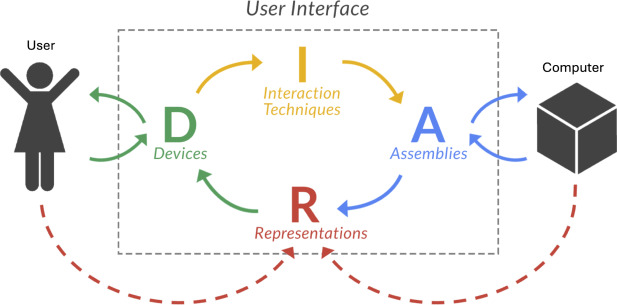


[Google](https://www.google.com)

---

\*Some text\*

```python
def hello_world():
		print("Hello, World!")
```

</details>

<details><summary>Shortcuts</summary>

IUI = Intelligent User Interfaces  
UI = User Interface  
AI = Artificial Intelligence

<!-- HCI = Human-Computer Interaction   -->
</details>

## 1.[Intro](./lecture/iui_lecture_01_intro.pdf)

<details><summary>Definition of IUIs</summary>

> Intelligent user interfaces (IUIs) are human-machine interfaces that aim to improve the **efficiency, effectiveness, and naturalness** of human-machine interaction by **representing, reasoning, and acting on models** of the user, domain, task, discourse, and media (e.g., graphics, natural language, gesture).
> (Wahlster & Maybury, 1998)

</details>

<details><summary>Explain approaches and goals of IUI</summary>
 
| | Description | Keywords from definition |
|---|---|---|
| **Goals** | What IUIs aim to achieve | Efficiency, Effectiveness, Naturalness |
| **Approaches** | How IUIs achieve it | Models, Data — representing, reasoning, acting |

#### Goals explained

| Goal              | Meaning                                                    |
| ----------------- | ---------------------------------------------------------- |
| **Efficiency**    | Users complete tasks faster, with less effort              |
| **Effectiveness** | Users achieve their goals more accurately                  |
| **Naturalness**   | Interaction feels intuitive, closer to human communication |

#### Approaches explained

| Approach         | Meaning                                        | Example                                            |
| ---------------- | ---------------------------------------------- | -------------------------------------------------- |
| **Representing** | Building a model of the user, task, or context | Storing user preferences, tracking current task    |
| **Reasoning**    | Using the model to draw conclusions            | Inferring what the user wants next                 |
| **Acting**       | Using conclusions to adapt the UI or output    | Showing a relevant suggestion, changing the layout |

#### What models can IUIs reason about?

| Model               | What it captures                                           |
| ------------------- | ---------------------------------------------------------- |
| **User model**      | Who is the user? What are their goals, habits, expertise?  |
| **Domain model**    | What is the subject area? (e.g. medical, legal, music)     |
| **Task model**      | What is the user trying to do right now?                   |
| **Discourse model** | What has been said/done so far in the interaction?         |
| **Media model**     | What modalities are available? (graphics, speech, gesture) |

</details>

<details><summary>Three Principle Areas of AI in IUIs</summary>

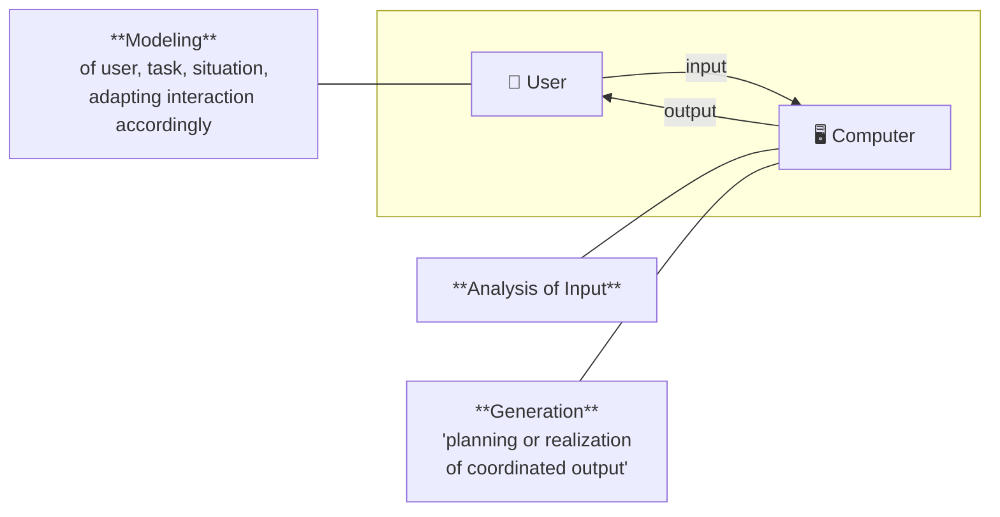
```mermaid
graph LR
    M["**Modeling**
    of user, task, situation,
    adapting interaction accordingly"]

    subgraph center[" "]
        direction TB
        U["👤 User"] -->|input| C["🖥️ Computer"]
        C -->|output| U
    end

    A["**Analysis of Input**"]
    G["**Generation**
    'planning or realization
    of coordinated output'"]

    M --- U
    A --- C
    G --- C
```

| Area                  | Description                                                                          | Concrete Example                                                                                                        |
| --------------------- | ------------------------------------------------------------------------------------ | ----------------------------------------------------------------------------------------------------------------------- |
| **Modeling**          | AI builds a model of the user, task, or situation and adapts interaction accordingly | Netflix user model — AI tracks watch history and infers preferences to personalise the UI and recommendations           |
| **Analysis of Input** | AI interprets and understands what the user provides                                 | Speech recognition in Alexa — AI analyses the audio signal and extracts the user's intent ("set a timer for 5 minutes") |
| **Generation**        | AI plans and produces coordinated output for the user                                | Gmail Smart Reply — AI generates short reply suggestions based on the received email                                    |

</details>

<details><summary>Describe concrete examples of IUI</summary>

- Text suggestions (e.g. Gmail Smart Compose)
- Chatbots (e.g. ChatGPT)
- Semantic image editing: editing images by describing the desired change in natural language (e.g. „Smart Portrait Filters“ in Adobe‘s Photoshop)
- Speech-based UIs: interactive systems that understand spoken language (e.g. Alexa)
- Biometric UIs: interactive systems that recognize you (e.g. phone unlock)
- UIs for co-creation: UIs where both human + AI modify a digital artefact (e.g. DALL-E)
- Predictive input: improving or enabling input by modelling & predicting user behaviour
</details>

<details><summary>Explain (abstractly) what AI, models, and data are used for in IUI</summary>

### The Big Picture

| Concept   | What it is                                                   | What it's used for in IUI                                       |
| --------- | ------------------------------------------------------------ | --------------------------------------------------------------- |
| **Data**  | Raw collected information (behaviour, text, images, signals) | Used to train models and understand user/context at runtime     |
| **Model** | A learned or hand-crafted representation of patterns in data | Used to reason about user, task, situation and make predictions |
| **AI**    | Algorithms that learn from data and make decisions           | Used to analyse input, adapt the UI, and generate output        |

### How They Work Together

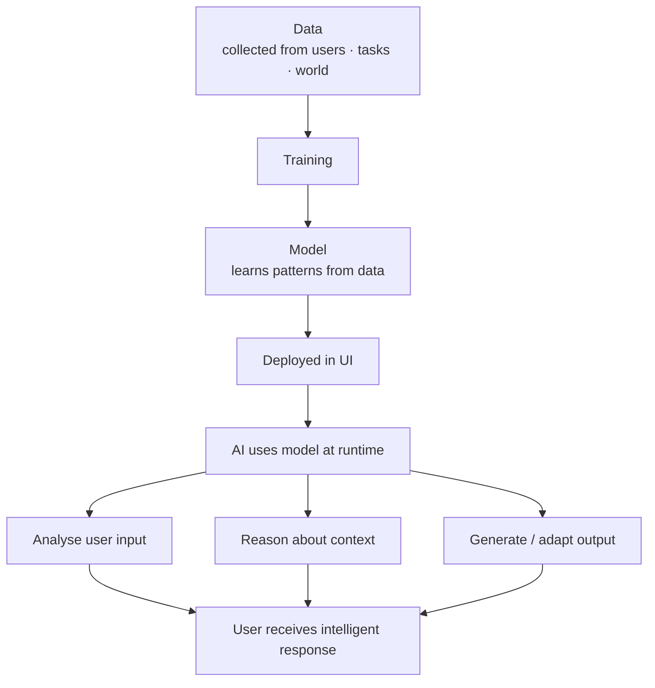
```mermaid
graph TD
    A[Data\ncollected from users · tasks · world] --> B[Training]
    B --> C[Model\nlearns patterns from data]
    C --> D[Deployed in UI]
    D --> E[AI uses model at runtime]
    E --> F[Analyse user input]
    E --> G[Reason about context]
    E --> H[Generate / adapt output]
    F --> I[User receives intelligent response]
    G --> I
    H --> I
```

### Concrete Roles in IUI

| Used for                     | Example                                                                 |
| ---------------------------- | ----------------------------------------------------------------------- |
| **Understanding user input** | Speech model trained on audio data → recognises spoken commands         |
| **Modelling the user**       | Interaction data → model learns preferences → UI adapts                 |
| **Generating output**        | Text data → language model → suggests email replies (Gmail Smart Reply) |
| **Improving interaction**    | Touch data → model predicts finger trajectory → reduces visual lag      |
| **Personalising content**    | Watch history → recommendation model → Netflix suggests films           |

### Key Takeaway

> In IUI, **data** trains **models**, and **AI** uses those models at runtime
> to make interaction more **efficient, effective, and natural** —
> by adapting to the user instead of requiring the user to adapt to the system.

</details>

<details><summary>DIRA</summary>

**DIRA** is a conceptual model of UI


| Element                    | Role                                                      | Examples                                                                 | Design Concerns                                           | What It Means in Practice                                                            |
| -------------------------- | --------------------------------------------------------- | ------------------------------------------------------------------------ | --------------------------------------------------------- | ------------------------------------------------------------------------------------ |
| **D**evices                | Sense the user and display representations                | Buttons, mice, touchscreens, speakers                                    | Expressiveness, sensing range, latency                    | How accurately does the device capture input? Is there a noticeable delay?           |
| **I**nteraction Techniques | Map what is sensed by devices to operations on assemblies | Pointing, selection, drag & drop, C-D ratio, movement gain               | User performance: time, errors, accuracy, learnability    | Does the user learn quickly? Do they make mistakes? Is the mapping intuitive?        |
| **R**epresentations        | Embody the user and the computer                          | Cursor, avatar, icons, text, desktop, virtual objects, audio, menu items | Semantic distance, metaphors, recognition, affordance     | Is it clear to the user what an element does? (e.g. trash icon = delete)             |
| **A**ssemblies             | Organize representations and connect to the computer      | File/icon layout on desktop, notification rules, menu item availability  | Match with user tasks, discoverability, responsive design | Can the user easily find what they need? Does the UI adapt well across screen sizes? |

---

### DIRA Applied to IUI

For each element, we can ask: **what can AI achieve here?**

| Element | AI Application                                                 | Example                                                    |
| ------- | -------------------------------------------------------------- | ---------------------------------------------------------- |
| **D**   | New sensor with AI-based signal processing                     | Google Soli — radar-based gesture recognition              |
| **I**   | Predicting finger/pen trajectory to reduce visual lag          | Better stylus control on tablets without hardware upgrades |
| **R**   | Learning representations from data to enable similarity search | Visual search in a web shop                                |
| **A**   | Automatically distributing UI elements across multiple devices | Adaptive multi-device UI layout                            |

---

### Two Framings of IUI (related to DIRA)

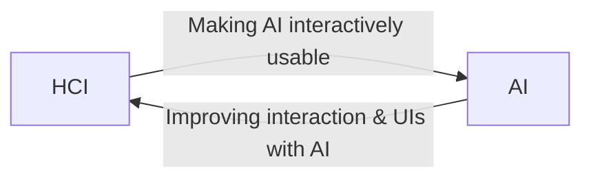
```mermaid
graph LR
    HCI -->|Making AI interactively usable| AI
    AI -->|Improving interaction & UIs with AI| HCI
```

| Framing        | Direction | Key distinction                                                                                              | Example                                                                  |
| -------------- | --------- | ------------------------------------------------------------------------------------------------------------ | ------------------------------------------------------------------------ |
| **UIs for AI** | HCI → AI  | the UI _wraps_ around the AI, making it accessible. Without the UI, the AI would be unusable for most people | Chat interface (ChatGPT) enables users to interact with a language model |
| **AI for UIs** | AI → HCI  | the AI _enhances_ an existing UI. The UI existed before; AI just makes it smarter or more powerful           | Smart Reply in Gmail improves how fast users can respond to emails       |

---

### Exam Question

> Name the four elements of the DIRA model and give one example of how AI could enhance each element in an intelligent user interface.

**Model Answer:**

- **D (Devices):** AI processes raw sensor signals → e.g. Google Soli interprets radar data as gestures
- **I (Interaction Techniques):** AI predicts pen trajectory → reduces visual lag on touchscreens
- **R (Representations):** AI learns embeddings → enables image similarity search in a web shop
- **A (Assemblies):** AI distributes UI elements across devices → adaptive multi-device layout
</details>

<details><summary>What can AI do in user interfaces?</summary>

| Category            | Role                                        | Examples                                                                       | What It Means in Practice                                                                         |
| ------------------- | ------------------------------------------- | ------------------------------------------------------------------------------ | ------------------------------------------------------------------------------------------------- |
| ⌨️ **Input**        | **Improve doing** things with a UI          | Text suggestions, touch predictions → improve speed, reduce errors             | The user still does the task themselves, but AI makes it faster, easier, or less error-prone      |
| 🎙️ **Modalities**   | Enable **new ways of doing** things in a UI | Touch, gestures, natural language, voice                                       | AI unlocks interaction channels that weren't usable before (e.g. speaking instead of typing)      |
| 🔨 **Capabilities** | Enable users **to do new things**           | Write emails in a different language                                           | AI expands what a user is able to achieve — tasks that were previously impossible become possible |
| 🖥️ **Output**       | Inform what to **show** when and how        | Redirected walking, recommendations                                            | AI decides what content or feedback is shown to the user, personalizing or adapting the display   |
| ⚙️ **Automation**   | Make decisions and/or **act for users**     | AI system placing elements in a game level editor, not just the level designer | AI takes over (parts of) the task — the user delegates instead of doing every step themselves     |

</details>

<details><summary>Tool-Style vs Agent-Style UIs. !!!! How IUIs relate to this distinction</summary>

|                      | Tool-style                                 | Agent-style                            |
| -------------------- | ------------------------------------------ | -------------------------------------- |
| **Core idea**        | User does the task via direct manipulation | User delegates the task to the system  |
| **Initiative**       | User has full initiative                   | System has (more) initiative           |
| **Process**          | User acts out every step                   | System hides the process, shows result |
| **Feedback**         | Immediate, live feedback                   | System acts in background              |
| **Anthropomorphism** | None                                       | Often present (name, voice, "I")       |
| **Example**          | Photoshop gaze slider                      | Amazon Alexa                           |

### Mixed Initiative Systems

> Most IUIs sit **somewhere in between** — neither pure tool nor pure agent.
> This middle ground is called a **mixed initiative** system (Horvitz, 1999).

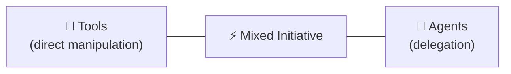
```mermaid
graph LR
    T["🔨 Tools\n(direct manipulation)"]
    M["⚡ Mixed Initiative"]
    A["🤖 Agents\n(delegation)"]
    T --- M --- A
```

</details>

### Exam Questions

> Reflect on software, apps, devices that you use: Which might have an IUI? How do you benefit from it (or not)?

**A:** Examples from students: **YouTube** — recommender system surfaces new videos matching taste, but creates filter bubbles and can waste time. **Google Maps** — traffic prediction makes navigation faster, though not always the optimal route. **Smartphone keyboard** — word prediction saves typing, but wrong predictions cause errors. **Mac file explorer** — recent files shortcut helps, but breaks muscle memory and disappears after time — raises the question: should UIs be predictable rather than adaptive?

> Explain three principle areas of AI in IUIs, with a concrete example application for each.

**A:** **Analysis of Input** — AI interprets what the user provides (e.g. fingerprint unlock). **Modeling** — AI builds a model of the user/situation and adapts accordingly (e.g. keyboard predicting intended tap position). **Generation** — AI plans and produces output for the user (e.g. Gmail Smart Reply generating auto-replies).

> What does AI (e.g. a recommendation system) achieve for users in the UI of a movie streaming platform?

**A:** AI personalises the homepage based on watch history and preferences — different users see different content. Users find relevant movies faster, spend less time searching, and are more likely to stay engaged. Result: the app feels tailored to each individual from the moment they open it.

> Explain the differences between tool-style and agent-style UIs, and how IUIs relate to this distinction.

**A:** **Tool-style** — user has full initiative, applies actions step by step via direct manipulation (e.g. Photoshop). **Agent-style** — user delegates tasks to the system, which acts with autonomy and hides the process (e.g. Alexa). IUIs often sit between the two: they use AI to adapt or automate parts of the interaction, making them **mixed-initiative** systems — neither purely tool nor purely agent.

## 2.[Intro AI & HCI](./lecture/iui_lecture_02_intro_ai_hci.pdf)

<details><summary>Goals of AI</summary>

- **Emulation goal**: understand and reproduce human abilities  
  → system behaves like a human, often anthropomorphic  
  → _Example:_ voice assistant (Siri, Alexa) — mimics human conversation  
  → _AI tasks:_ speech recognition (classification), language understanding (LLM)

- **Application goal**: apply AI to build useful tools and systems  
 → system augments or supports the user, doesn't pretend to be human  
 → _Example:_ Google Maps traffic prediction — helps user navigate faster  
 → _AI tasks:_ regression (predict travel time), recommendation (route selection)
</details>

<details><summary>Design process: Problem-driven vs. Tech-driven</summary>

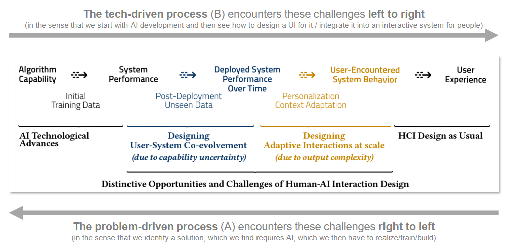

|                             | Problem-driven (A)                    | Tech-driven (B)                                                                    |
| --------------------------- | ------------------------------------- | ---------------------------------------------------------------------------------- |
| **Starting point**          | A user problem                        | An AI capability                                                                   |
| **Direction of challenges** | Right → left                          | Left → right                                                                       |
| **Process steps**           | Discover → Define → Develop → Deliver | Characterize tech → Identify user activities → Understand → Tech-UX co-development |
| **Risk**                    | May find AI isn't actually needed     | May build something users don't need                                               |

> AI's **capability uncertainty** and **output complexity** add additional steps to a typical HCI pathway and make some systems distinctly difficult to design. [Yang, 2020]

</details>

<details><summary>Design process: Double Diamond</summary>
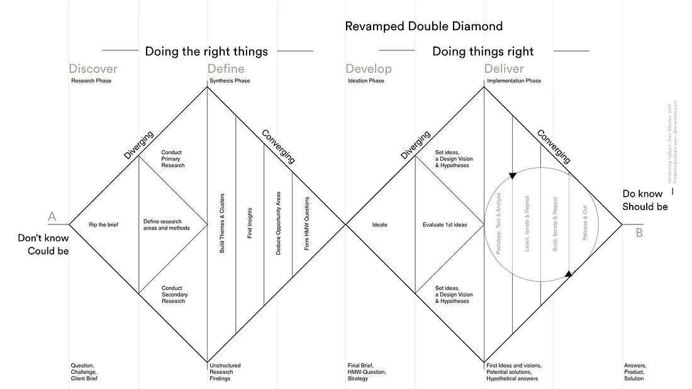

- 1st diamond: **understanding the problem** and user needs = Validation → are we building the right thing?
- 2nd diamond: **designing the solution** = Verification → are we building it correctly?
  
_Skipping the 1st diamond → risk of solving the wrong problem entirely._

### AI challenges mapped to the Double Diamond

| Challenge                                                  | Stage   |
| ---------------------------------------------------------- | ------- |
| Hard to explain to the user what AI can/cannot do          | Deliver |
| Unsure if AI could do X well enough                        | Define  |
| Don't know if you have the right data to train a model     | Develop |

</details>

<details><summary>AI/ML methods for UI — Output, Input, Design</summary>

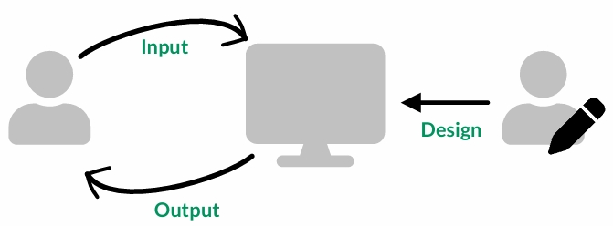

### Output: providing structure

**Idea:** use AI/ML to decide _what_ to show the user

**What it does:**
- Filtering
- Finding similar content
- Creating new content

| UI Need | AI/ML Method | Example |
|---|---|---|
| _Discovering_ groups | **Clustering** | Google Photos face grouping; Spotify Daily Mixes |
| Sorting into _given_ categories | **Classification** | Labeling photos after user names a person |
| Filtering & selecting content | **Recommendation systems** (collaborative filtering or content-based filtering) | Netflix homepage |
| Finding similar content | **Representation learning, dim. reduction** | "Find shoes like this photo" |
| Creating or transforming content | **Generative AI, LLMs** | ChatGPT; DALL-E |

### Input: interpreting unstructured input (adapt to the user)

**Idea:** use AI/ML to adapt the interaction & UI to the individual

| Problem | Timeframe | AI/ML Method | Example |
|---|---|---|---|
| Adapt low-level interaction params | Immediate / short-term | **Regression, probabilistic modelling** | pointer transfer function |
| Adapt UI to habits & workflows | Long-term | **Statistics on logged interaction data** (raw data) | Recent files in OS |
| Adapt UI to habits & workflows | Long-term | **Reinforcement learning** (can be trained for every user) | Adaptive menu layout |
 
**Key example — Fitts' Law:** the farther and smaller the target, the longer it takes to reach it.
- Input: finger trajectory, distance, target width
- Output: predicted touch point + estimated time
- Why it matters: AI predicts where the finger is going before it lands → UI responds early → feels instant. Example: iOS pre-renders tap targets before finger lands, reducing perceived latency.

### Design: computational UI optimisation

**Goal:** find the best design choice when the design space is too large to explore manually

**AI/ML methods:**

| Problem | AI/ML Method | Example |
|---|---|---|
| Too many design combinations | **Computational optimisation** | Keyboard layout optimisation (QWERTY vs Dvorak vs Colemak) |

**Example:**
- types of keyboards: QWERTY, Dvorak, Colemak. QWERTY is the most common but not the most efficient layout. AI can be used to optimise keyboard layouts based on user data to improve typing speed and reduce errors
</details>

<details><summary>Full summary table — UI needs mapped to AI/ML methods</summary>

| Scope      | UI Need                                        | Typical AI/ML Method                                      |
| ---------- | ---------------------------------------------- | --------------------------------------------------------- |
| **Output** | Discovering groups                             | Clustering                                                |
| **Output** | Sorting by given categories                    | Classification                                            |
| **Output** | Filtering & selecting content to display       | Recommendation systems                                    |
| **Output** | Finding & revealing similar content            | Representation learning, dimensionality reduction         |
| **Output** | Interacting with the space of possibilities    | Representation learning, dim. reduction, generative model |
| **Output** | Creating or contextually transforming content  | Generative AI, LLMs                                       |
| **Input**  | Recognising the user                           | Classification                                            |
| **Input**  | Adapting interaction parameters to the user    | Regression, probabilistic modelling                       |
| **Input**  | Adapting the UI to user habits and workflows   | Statistics on logged data, Reinforcement learning         |
| **Input**  | Processing sensor input (e.g. VR controllers)  | Digital signal processing                                 |
| **Design** | Creating and evaluating UI design alternatives | Computational optimisation                                |

</details>

<details><summary>How to analyse a given IUI (checklist) — which AI/ML methods does it use?</summary>

**1. What does the system show?**
- Content filtered or ranked? → **Recommendation system**
- Items grouped? → **Clustering**
- Content generated? → **Generative AI / LLM**

**2. How does it handle user input?**
- Recognises the user? → **Classification** (biometrics)
- Corrects or adjusts input? → **Regression**
- Changes over time with usage? → **Statistics / RL**

**3. Was AI used in the UI design itself?**
- Layout or parameters optimised? → **Computational optimisation**

**Example — Google Photos:**

- Groups people automatically → **Clustering** (face detection + grouping)
- Labels groups after user names them → **Classification** (once labeled, new photos are sorted)
- Suggests memories → **Recommendation system**

**Example — Spotify:**

- Daily Mixes = clusters of listening history → **Clustering**
- "Because you listened to X" → **Recommendation system** (collaborative filtering)
- New releases for you → **Representation learning** (embedding similarity)

</details>

### Exam Questions

> Explain the two goals of AI, and for each give an example of an interactive system. Also describe which ML/AI tasks appear in your example.

**A:** **Emulation goal** — understand and reproduce human abilities (e.g. a voice assistant mimicking conversation → speech recognition + NLU). **Application goal** — apply AI to build useful products (e.g. Google Maps traffic prediction → regression for travel time, recommendation for route). Note: the same method (e.g. LLM) can serve either goal depending on what it's used for.

> List three AI methods and give examples of what you could do with them for IUIs.

**A:** **Classification** — adapt phone behaviour (near ear → quieter; facing user → speaker mode). **Recommendation system** — show relevant content (Netflix, news feed). **NLP** — understand language input for a chatbot. **Reinforcement learning** — gradually optimise UI layout based on what users click. **Generative model / LLM** — summarise long content or adjust text contextually. **Clustering** — group similar files or photos into folders.

> Reflect on software you use — which features might use classification, regression, or clustering?

**A:** **YouTube** homepage — clustering (topic groups) + classification (category labels). **Photo gallery** — face detection → clustering into person-specific albums. **Netflix/YouTube** — recommendation systems personalise the feed. **Touchscreen keyboard** — regression predicts touch position, improving accuracy. **Google Maps** arrival time — regression (continuous value: minutes). **Email spam filter** — classification.

> Design an intelligent museum app that shows info about objects in the camera view. What data and AI does it need?

**A:** Needs: image data of all exhibits from multiple angles + live camera feed. AI uses **image classification / similarity search** to recognise the exhibit in view. User taps the object → detail popup appears. Optional: "Ask tour guide" button opens a chatbot (LLM) with deeper knowledge about the exhibit.

> How would you improve the layout of a news website based on user interests? What data and AI would you use?

**A:** Collect data on which articles users click and how long they stay (implicit feedback). Use **clustering** to group articles matching similar interest patterns, and **recommendation system** to personalise the homepage layout. Explicit feedback (rating articles) can also be added to improve accuracy over time.

## 3.[Recommendation Systems](./lecture/iui_lecture_03_rec_sys.pdf)

<details><summary>Why recommendations? Motivation</summary>

**Pragmatic:** Recommendations are very common in end-user apps — sometimes they *are* the whole UI (e.g. Netflix homepage, YouTube feed).

**Conceptual:** Information overload — the gap between what is available and what humans can actually process (limited by attention, cognitive resources, time). Recommenders help bridge this gap.

| Context | Example |
|---------|---------|
| Everyday | Netflix, YouTube, Spotify, Amazon |
| High-stakes | Diversion decision support for pilots (which airport to land at in an emergency) |

</details>

<details><summary>Algorithms — content-based filtering (item vectors + cosine similarity), collaborative filtering (user-based и item-based), mermaid-схема</summary>

### Content-based filtering

**Idea:** "Item X is similar to what you liked before" — based on item features.

1. Define a list of features relevant to describe items (e.g. language, genre, time period)
2. Represent each item as a numerical vector of those feature values
3. Build a user model as a vector with the same features (e.g. how much the user likes "thriller")
4. Recommend items whose vector is most similar to the user vector (e.g. cosine similarity)

---

### Collaborative filtering (CF)

**Idea:** "People who liked what you liked also liked item X" — no knowledge of item content needed.

| Variant | How similarity is computed | What is recommended |
|---------|---------------------------|---------------------|
| **User-based** | Similarity between users based on their ratings | Items that similar users liked |
| **Item-based** | Similarity between items based on user ratings | Items similar to ones the user already liked |

> **Key property of CF:** We don't need any information about the actual content of items (e.g. book genre) to assess similarity — only ratings/interactions.

**Computation steps (user-based CF):**
1. Build a user–item rating matrix
2. Calculate similarity between users (e.g. cosine similarity → similarity matrix)
3. Multiply rating matrix by similarity weights → weighted rating matrix
4. Sum weighted ratings per item ÷ sum of similarities → predicted score → recommend top items

---

### Overview

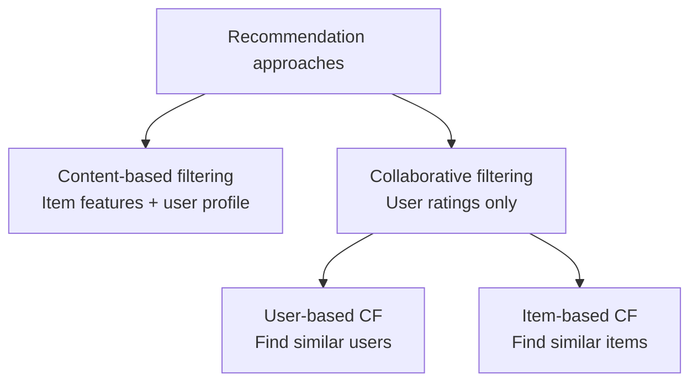
```mermaid
graph TD
    A[Recommendation approaches]
    A --> B["Content-based filtering<br/>Item features + user profile"]
    A --> C["Collaborative filtering<br/>User ratings only"]
    C --> D["User-based CF<br/>Find similar users"]
    C --> E["Item-based CF<br/>Find similar items"]
```

</details>

<details><summary>UI Design — presentation, 4 типа integration, quantity (Hick's Law, carousel/endless scroll/"more"), detail (3 уровня)</summary>

### Presentation

Not all UIs label items explicitly as "recommendations" — some just show them (e.g. YouTube homepage shows videos without a "recommended" label on every card).

**Design question:** Should the UI explicitly signal that an item is a recommendation? Why or why not?

---

### Integration

| Type | Description | Example |
|------|-------------|---------|
| **Main view** | Recommendations shown directly in the primary content area | "Similar items" below a product on Amazon |
| **Sidebar / context element** | Recommendations as a secondary panel next to main content | "You might also like" sidebar |
| **Temporal** | Next recommendation plays/appears automatically after current one | YouTube autoplay |
| **Task integration** | Recommendations appear inside the main task itself | Search query suggestions |

---

### Quantity — how many to show?

| Too few | Too many |
|---------|----------|
| Risks missing relevant options | Potentially overwhelming |
| User may feel constrained | Increases decision time (Hick's Law) |
| | May crowd out other UI features |

**Hick's Law:** increasing the number of choices will increase decision time logarithmically.

**UI patterns for "more":**

| Pattern | How it works |
|---------|-------------|
| **Carousel** | Horizontal scroll; half-cut content signals there's more |
| **"More" button** | User explicitly requests more items |
| **Endless scroll** | User implicitly triggers more items by scrolling |

---

### Detail — how much info per item?

| Level | Description | Example |
|-------|-------------|---------|
| **Key visual only** | Just a thumbnail | Movie poster grid on Netflix |
| **Visual + text** | Thumbnail + title (+ metadata) | YouTube thumbnail + title + channel |
| **Details on demand** | Basic view + hover/tap for more | Product card that expands on hover |

> **Design balance:** too little → can't distinguish options; too much → overwhelming and slow.

</details>

<details><summary>Interaction design — explicit/implicit feedback, functional interactions (keep & export, manipulate)</summary>

### Feedback interactions

| Type | Description | Example |
|------|-------------|---------|
| **Explicit feedback** | Primary purpose is giving direct feedback to the system | Like/dislike buttons, star rating, thumbs up/down |
| **Other interactions** | Explicit user actions, but not direct rec. feedback | Share, comment, bookmark |
| **Behaviour signals** | Feedback inferred from behaviour — implicit | Reading/viewing time, scroll depth, mouse movements, revisits |

---

### Functional interactions

| Type | Description | Example |
|------|-------------|---------|
| **Keep & export** | Save or move material beyond the recommendation context | Pin, bookmark, "Add to playlist", share |
| **Manipulate** | Work with recommendations within the app | Dismiss, compare, re-rank, refine, change settings, use as new query |

</details>

<details><summary>Algorithm meets UI — cold-start (3 случая + 3 решения), onboarding tradeoff, precision vs recall, exploitation vs exploration (3 UI-паттерна)</summary>

### Cold-start problem

Recommendations need initial data — but what if there is none?

| Case | Problem |
|------|---------|
| **New user** | No ratings or interactions yet |
| **New item** | Not rated by anyone yet |
| **New system** | Just created, no info on users or items |

**Solutions:**

| Solution | Description |
|----------|-------------|
| **Hybrid approach** | Start with content-based filtering; shift to CF once enough ratings exist |
| **Background info** | Use demographics, location, social context to bootstrap |
| **Onboarding UI** | Ask user explicitly (questionnaire, interest selection) |

**Onboarding tradeoff:**

> More info asked upfront → better initial recommendations, but more user effort and delay before getting to the app.
> Design goal: minimise friction while maximising initial recommendation quality.

---

### Precision vs Recall

| Metric | Question it answers |
|--------|---------------------|
| **Precision** | What fraction of shown recommendations is actually relevant? |
| **Recall** | What fraction of all relevant items did we actually show? |

**When to favour which:**

| Favour **Precision** when… | Favour **Recall** when… |
|---------------------------|------------------------|
| Users want to decide quickly | Users want to explore |
| Cost of engaging with irrelevant item is high | Cost of missing a relevant item is high |
| Missing a specific item is acceptable | Showing some irrelevant items is acceptable |

> Precision vs recall is an **explicit design decision**, not just an algorithmic side effect.

---

### Exploitation vs Exploration

| Mode | Description | Risk |
|------|-------------|------|
| **Exploitation** | Recommend more of what the user already likes | Filter bubble — user never discovers new things |
| **Exploration** | Actively suggest new or unfamiliar content | Lower short-term relevance |

**UI integration options:**

| Approach | Example |
|----------|---------|
| **Integrated** | Exploration items appear the same as regular recommendations |
| **Separate** | Dedicated "Discovery" mode or section (e.g. YouTube "New to you", Steam "Discovery queue") |
| **Mixed** | Hints at exploration mixed within regular recommendations |

> Study on physical activity apps: physically inactive users preferred exploration and gave higher ratings to novel activities. [Coppens et al., 2024]

</details>

<details><summary>Explaining recommendations — 5 типов объяснений + social signals</summary>

| Explanation type | What it refers to | Example |
|-----------------|-------------------|---------|
| **Top item** | Most liked overall or in a category | "This is the most popular sports clip right now." |
| **Top-N items** | Among the most liked | "This is in the top liked clips right now." |
| **Similar to item** | Relates to another item the user liked | "Since you liked X, you might also like this." |
| **Similar to users** | Relates to users with similar taste | "People like you liked this." / "Others who liked rock also liked this." |
| **Score / rank** | Numerical or verbal score shown per item | 98% match, or "Very high / High / Medium / Low" |

### Social signals

| Type | Description |
|------|-------------|
| **Abstract link** | Mentions a common community aspect (e.g. average star rating) |
| **Concrete link** | Mentions specific people (e.g. "Your friend Alice also liked this") |

</details>

<details><summary>Outlook — initiative, SwitchTube (control over control), forward vs backward reasoning</summary>

### Who takes initiative?

| Initiative | Example |
|-----------|---------|
| **User** | Browsing/searching on a dedicated recommendation website |
| **System** | Auto-playing the next video without user action |
| **Mixed** | Integrated recommendations in an app where users naturally want to browse more |

---

### Control over recommendations (SwitchTube)

**Key idea:** Give users "control over control" — let them switch between different recommendation interface modes.

> "Providing users with the ability to switch between interfaces gives a greater sense of agency, satisfaction, and goal alignment." [Lukoff et al., 2023]

---

### Forward vs backward reasoning

| Reasoning | Description |
|-----------|-------------|
| **Backward** | Classic rec: "here are options, think about which fits" |
| **Forward** | Help the user plan and reason toward a goal — not just options, but decision support |

> Especially relevant in high-stakes contexts like pilot diversion decisions. [Zhang et al., 2024]

</details>

### Exam Questions

> Explain the difference between content-based filtering and collaborative filtering. What is the key advantage of collaborative filtering?

**A:** In **content-based filtering**, similarity is computed between a user's taste and item features — we need information about the content (e.g. book genre). In **collaborative filtering (CF)**, similarity is computed between users (user-based) or between items (item-based) based purely on ratings/likes — no content knowledge needed. Key advantage of CF: it works without any domain knowledge about the items themselves.

> What is the cold-start problem? Describe three possible solutions.

**A:** The cold-start problem refers to the difficulty of making accurate recommendations when there is insufficient data about a new user, new item, or new system. Solutions: (1) **Onboarding surveys** — ask new users to rate items or indicate interests on sign-up; (2) **Demographic / contextual info** — use metadata (age, location, device) to infer initial preferences; (3) **Hybrid approach** — start with content-based filtering, then shift to CF once enough interactions are collected.

> Explain the tradeoff between precision and recall in recommendation systems and give an example of when you would favour each.

> Name four UI design factors for recommendation systems and explain each with an example.

> What is the difference between exploitation and exploration in recommendation systems? Give a UI example of how exploration can be supported.

> Describe at least three UI-related aspects to consider for recommendations in interactive systems.

**A:** **Feedback** — how users give feedback (e.g. like/dislike buttons, dismiss). **Explainability** — showing why an item was recommended builds trust ("Because you liked X"). **Onboarding** — collecting initial user interests to bootstrap recommendations. **Detail per item** — balance between too little (can't decide) and too much (overwhelming). **Quantity** — how many items to show at once.

> Describe types of user feedback that an interactive recommendation system could integrate.

**A:** **Explicit feedback** — direct actions like likes, dislikes, star ratings, or surveys. **Behavioural data** — implicit signals the system infers automatically: time spent on page, scroll depth, revisits. **Other interactions** — actions not intended as feedback but still usable: shares, bookmarks, comments.

## 4.[Prompting](./lecture/iui_lecture_04_prompting.pdf)

<details><summary>Новая парадигма — 3 эпохи взаимодействия (batch → interactive → intent-based), почему prompting exciting</summary>

Three paradigm shifts in human-computer interaction:

| Era | ~Year | Paradigm | Description |
|-----|-------|----------|-------------|
| **Batch** | ~1945 | Command batch | User specifies a complete workflow upfront; submitted to data center, processed overnight |
| **Interactive** | ~1965 | Turn-based | User and computer take turns one command at a time; user can reassess and modify |
| **Intent-based** | ~2023 | Prompting | User tells the computer what *outcome* they want, not *what to do* |

**Why this is seen as exciting:**

| Direction | Description |
|-----------|-------------|
| **Accessible, natural interaction** | People can interact in natural language, without technical training |
| **Customisable, flexible features** | Users can prompt the functionality they individually need, even beyond what developers thought of |
| **Computers finally "get it"** | Software "understands" content/meaning, not just file formats |

</details>

<details><summary>Типы промптов — zero/one/few-shot, diegetic vs non-diegetic, анатомия prompt-based interaction</summary>

**Prompt (noun):** a text string (or other input like image, music) that initiates/guides AI output

**Anatomy of prompt-based interaction:**
1. User writes prompt
2. AI processes prompt
3. AI outputs response
4. User (re)acts → UI design question: *how and "where" does this exchange take place?*

---

### Zero- / One- / Few-shot prompting

| Type | Description | Example |
|------|-------------|---------|
| **Zero-shot** | Instruction only | "Translate this into German: …" |
| **One-shot** | 1 example + instruction | One EN→DE example, then task |
| **Few-shot** | >1 example + instruction | Two+ EN→DE examples, then task |

→ More examples = more context = often better / more predictable output [Brown et al., 2020]

---

### Diegetic vs Non-diegetic prompting

| Type | Description | Example |
|------|-------------|---------|
| **Diegetic** | Prompt is part of the created artefact | "Once upon a time, there was a fox…" — beginning becomes part of the final text |
| **Non-diegetic** | Prompt is an instruction, not part of the artefact | "Write about the adventures of the fox" |

[Dang et al., 2023]

</details>

<details><summary>Сложности для пользователей — open input, dynamic functionality, varied output, 4 поведенческих паттерна</summary>

| Challenge | Description | Effect on user |
|-----------|-------------|----------------|
| **Open input possibilities** | Free text UIs don't impose structure or convention on input | Users are uncertain how to formulate input to get what they want |
| **Dynamic functionality** | Functionality is dynamically provided by LLM, not predefined as buttons | Users are uncertain what the system can do |
| **Varied output** | LLMs can generate varied and unexpected output | Users must provide guidance and evaluate output |

### How users write prompts (key findings)

| Behaviour | Issue |
|-----------|-------|
| Give instructions, underestimate examples | Examples can greatly improve results |
| Generalise capabilities from only a few interactions | Overgeneralise what's possible or not |
| Avoid repeating text | Repetition can be effective in longer prompts |
| Prefer polite phrasing | Increases input effort without clear benefit |

> **Key insight:** People approach prompting with intuitions from *talking to people* — especially in conversational UIs. [Zamfirescu-Pereira et al., CHI 2023]

</details>

<details><summary>Functional flexibility — function space metaphor, low vs high flexibility, shift ответственности на пользователя</summary>

**Metaphor:** Imagine all possible functions (translate, summarize, write, etc.) as a "space".

| UI type | Access to function space | How |
|---------|--------------------------|-----|
| **Classic GUI** (buttons, toolbars) | Specific references to fixed functions | Developer-determined, 1-to-1 mapping |
| **Prompt-box UI** | Any function in the space | Depends entirely on user's prompt |
| **Conversational UI** | Iterative "walking through" the space | Step-by-step refinement |

### Functional flexibility as a design factor

| Flexibility | Meaning | Example |
|-------------|---------|---------|
| **Low** | 1-to-1 mapping of UI element to function | "+" button = addition only |
| **High** | 1-to-N mapping of UI element to function | One prompt box = translate / summarize / draft / … |

> **Design principle:** Introducing open prompting in a UI *shifts responsibility* for finding useful functionality from designers/developers to end-users.

**Design question:** What degree of functional flexibility is best for the target group and use case? A mix (buttons for common functions + prompt box for custom) is often optimal. [Lehmann & Buschek, 2024]

</details>

<details><summary>Metacognitive demands — 5 вопросов пользователя, 3 UI-подхода для поддержки метакогниции</summary>

**Metacognition** = thinking about your own thinking — knowing what you know, monitoring your own process.

Prompting-based UIs require users to bring **metacognitive skills**:

| Question users must answer | Type |
|---------------------------|------|
| Should I use AI here? | Strategy |
| For which part of the task? | Task decomposition |
| How can I express what I want? | Prompt formulation |
| Is this result good enough? | Self-evaluation |
| How can I improve it? | Monitoring & control |

[Tankelevitch et al., CHI 2024]

### UI design to support metacognition

| Approach | Example |
|----------|---------|
| **Task decomposition support** | System automatically breaks down the user's task into steps |
| **Proactive sub-task prompting** | System suggests concrete examples for each sub-task |
| **Self-evaluation support** | System notifies user when prompts are highly unspecified and suggests reflection |

</details>

<details><summary>Промпты в UI — 4 перспективы: input / output / functionality-provider / dev tool</summary>

|  | Prompts as *means to an end* | Prompts as *subject* of interaction |
|--|------------------------------|--------------------------------------|
| **Users work with prompts** | Prompts as **input** (e.g. ChatGPT prompt box) | Prompts as **output / subject of work** (e.g. app to share/browse prompts) |
| **Designers/Devs work with prompts** | Prompts as **functionality-provider** (e.g. "Translate" button backed by a hidden prompt) | Prompts as **development tool** (e.g. tools to analyse prompt-based systems during deployment) |

</details>

<details><summary>Designer perspective — "herding cats", prompt fickleness (individual / addition / no guardrails)</summary>

> "Prompts made achieving '80%' UX goals easy, but not the remaining 20%. Fixing the few remaining interaction breakdowns resembled herding cats: we could not address one UX issue or test one design solution at a time; instead, we had to handle everything everywhere all at once."
> [Zamfirescu-Pereira et al., DIS 2023]

### Prompt "fickleness"

| Issue | Description |
|-------|-------------|
| **Individual** | A prompt's effectiveness can highly depend on exact phrasing |
| **Addition problem** | Combining two individually effective instructions can make both ineffective |
| **No guardrails** | No prompt can reliably make an LLM say "I don't know" when it should |

</details>

<details><summary>UI-направления beyond chatbots — ChainForge, Luminate, Graphologue, DirectGPT, DynaVis, Composable Workspaces</summary>

| System | Key idea | Challenge addressed |
|--------|----------|---------------------|
| **ChainForge** (Arawjo et al., 2024) | Visual toolkit for prompt engineering and LLM hypothesis testing | Better developer tooling for working with prompts |
| **Luminate** (Suh et al., 2024) | Structured exploration of a "space of ideas" generated by prompting | Makes prompting feel less trial-and-error |
| **Graphologue** (Jiang et al., 2023) | LLM responses visualised as interactive diagrams / mind maps | Avoids "walls of text"; enables information interaction |
| **DirectGPT** (Masson et al., 2024) | Click on objects in the UI to insert them directly into a prompt | Combines direct manipulation with prompting |
| **DynaVis** (Vaithilingam et al., 2025) | Prompts are synthesised into reusable graphical widgets in the UI | Users don't need to re-enter prompts for repeated use |
| **Composable Workspaces** (Amin et al., 2025) | Users gradually build a personal workspace from prompt widgets | Supports iterative, multi-aspect creative writing |

### Design directions summary

- Developer UIs/tools for working with prompt-based systems
- Better exploration of prompts and their outputs
- Direct manipulation interaction with prompts
- Combining graphical elements with prompts
- Enabling users to work with prompts without re-typing
- Representing prompts persistently in the UI as widgets

</details>

### Exam Questions

> Describe the key difference between zero-shot, one-shot, and few-shot prompting and give an example of each.

**A:** **Zero-shot** — instruction only, no examples ("Translate this into German: …"). **One-shot** — one input-output example + instruction. **Few-shot** — multiple examples + instruction; the model uses them as context to produce more predictable output. Impact if a system only works well with few-shot: users must provide examples every time they prompt → higher input effort, more cognitive load.

> Explain the concept of "functional flexibility" as a UI design factor in prompt-based systems. What shift in responsibility does it introduce?

> What are metacognitive demands in the context of prompting-based UIs? Give two concrete examples of questions users face.

> Name three challenges users face when interacting with prompt-based systems and explain why they occur.

> Explain the difference between diegetic and non-diegetic prompting with an example.

> Describe a pain point of prompting UIs from your own experience and suggest a UI improvement.

**A:** Example: **lack of memory continuity** — users must re-explain context at the start of every new session, which breaks workflow. Improvement: a persistent user profile panel where users store preferences, roles, and recurring context that is automatically included in every prompt. This can be seen as a **scrutable/editable user model**, or as **structured prompting** — splitting input into a regular prompt (instruction) and a persistent context panel.

> Describe a potential prompt-based UI feature for existing software that doesn't use prompting yet.

**A:** Example: **Spotify prompt playlist** — user types "play relaxing music for studying" and AI generates a personalised playlist. This works especially well because natural language vagueness matches the "vibe" nature of musical preferences — staying vague is a feature, not a bug, in this context.

> Describe UI ideas for instructing a text-to-image generation system without entering text.

**A:** (1) **Multi-aspect input** — split UI into separate controls for different aspects (style, mood, subject), some without text. (2) **Mind-map UI** — clicking a bubble decides one aspect of the image; new bubbles appear for sub-aspects; one bubble always stays empty for free input. (3) **Composer view** — drag & drop existing images to compose a new scene; generated output updates live next to the composed input.

## 5.[Conversational UI](./lecture/iui_lecture_05_conversational_UIs.pdf)

<details><summary>Motivation & technologies — зачем CUI, pipeline (NLU → dialogue model → NLG), rule-based vs LLM</summary>

**Why use conversational UIs?**

- Feel natural — learned from human-to-human interaction
- Support hands-free input (via voice)
- Don't require a graphical display (via voice)
- Keep context/history across the interaction
- Can be "about" something (main task + conversation about it in parallel)
- Accommodate negotiation and clarification
- Go well with prompting (LLMs)
- Communicate personality

**Technologies involved:**

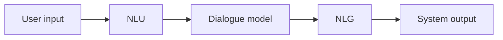
```mermaid
graph LR
    A[User input] --> B[NLU]
    B --> C[Dialogue model]
    C --> D[NLG]
    D --> E[System output]
```

**Technical approaches:**

| Approach | Description | Example |
|----------|-------------|---------|
| **Rule-based** | Hand-authored replies using scripting language (e.g. AIML) | Kuki — 5× Loebner Prize winner; near-zero latency, resistant to toxicity |
| **ML / LLM-based** | Prompting a large language model to generate responses | ChatGPT, most modern chatbots |

> Rule-based still has advantages: predictable, zero latency, safe for production. ML/LLMs are more flexible but harder to control.

---

> **Exam Q:** Name and briefly describe three technical tasks / components required for interaction with a voice assistant.

1. **Voice recognition / NLU** — converts spoken input into text and extracts the user's intent (what was said and what was meant)
2. **Dialogue model** — manages conversation context, e.g. tracking what has already been said and handling contextual references
3. **Voice synthesis / NLG** — generates a natural language response and converts it back to speech for the user

</details>

<details><summary>Design factors — modality (voice vs text), free text vs fixed options, output design (linguistic + paraverbal), дополнительные визуальные элементы</summary>

### Modality: Speech/voice vs Text

| | Speech / Voice | Text |
|--|----------------|------|
| ✅ | Hands-free (e.g. driving) | Integrates with GUI elements & visual content |
| ✅ | Paraverbal cues (tone, intonation) | Status/progress easier to display |
| ❌ | Status/progress hard to display | Requires screen |
| ❌ | Time pressure on user | Requires text input method & visual attention |
| ❌ | Unsuitable in noisy/social contexts | — |

> Also possible: text input via speech + output via text → keeps visual requirements but frees hands.

---

### Text input: Free text vs Fixed options

| | Free text | Fixed options |
|--|-----------|---------------|
| ✅ | Feels like a "real" conversation | Better control for designer/developer |
| ✅ | High functional flexibility | Guides user, communicates functionality |
| ✅ | Free user expression | Lower input effort |
| ❌ | No guardrails; edge cases hard to handle | Feels less natural |
| ❌ | Doesn't communicate limits of functionality | Limited scope — may miss user needs |

---

### Output design dimensions

| Dimension | Examples |
|-----------|----------|
| **Linguistic** (words used) | Word choice, sentence length, formality level, slang, puns, irony, cultural proverbs |
| **Paraverbal** (voice) | Prosody, tone, dialect, intonation, gender |

> These shape the perceived *personality* of the chatbot — must fit the use-case and context.

---

### Additional visual elements (for screen-based CUIs)

| Element | Role |
|---------|------|
| **Other GUI elements** | Status, progress bar, links, tables, images alongside chat |
| **Surrounding presentation** | Avatar or "profile" for the chatbot — shapes expectations before first message |
| **Physical device** | Device design, form factor, indicator lights |

</details>

<details><summary>Design guidelines — 5 практических правил</summary>

| Guideline | Example |
|-----------|---------|
| **Tell users what they can do** | "You can ask for today's weather or a weekly forecast." |
| **Tell users where they are** | "Today's forecast is sunny and dry" (not just "sunny and dry") |
| **Prefer examples over instructions** | Use examples in the greeting or help feature |
| **Limit information per turn** | Max 3 options — users must hold these in short-term memory |
| **Use visual feedback if possible** | Indicator light on device; typing indicator in on-screen chatbot |

</details>

<details><summary>Conversation elements & breakdowns — 7 элементов диалогового флоу + 5 стратегий repair (Repeat / Give options / Confirm / Defer / Explain)</summary>

### Conversation elements

| Element | Purpose | Example |
|---------|---------|---------|
| **Start** | Establish relationship, provide orientation | "Hi, I'm your assistant. I can help with X or Y." |
| **Suggestions** | Present options | "I can help you do X or Y." |
| **User input** | Wait for and process user input | "Let me know what you'd like to do next." |
| **Confirmation** | Confirm action, restate interpretation | "Ok, I'll book that for you now." |
| **Progress indicator** | Show progress toward goal | "Almost there! To finish, I just need your phone number." |
| **Error handling** | Acknowledge limits or breakdowns | "Sorry, I didn't understand. Could you rephrase?" |
| **End** | Provide a clear closing | "All done! Have a great day. Goodbye." |

> The "middle part" (suggestions → input → confirmation) is typically **repeated** for each step or piece of information needed.

---

### Breakdown repair strategies

When the bot doesn't understand, it can use different strategies:

| Strategy | Description | Example |
|----------|-------------|---------|
| **Repeat** | Ask the user to try again | "I don't quite understand. How can I help you today?" |
| **Give options** | Present choices to clarify intent | "Which of these are you trying to do? 1) … 2) … 3) … 4) None" |
| **Confirm** | Propose an interpretation | "Sounds like you want to add a card. Is that right?" |
| **Defer** | Hand off to a human agent | "I'll refer you to a human agent who will respond shortly." |
| **Explain** | Highlight the misunderstood part | "I've highlighted the part I can't process. Could you rephrase?" |

> **Overall principle:** acknowledge breakdowns, assist user repair, proactively suggest solutions.
> Note: "not understanding" is not the only breakdown — requests beyond scope or permissions also cause breakdowns.

[Ashktorab et al., 2019]

</details>

<details><summary>Implementing CUIs — 3 подхода: hand-built flow, function calling, system prompt с плюсами/минусами</summary>

### Option 1: Hand-built intent flow with prompting

```
User input
    → Prompt for intent recognition (classify into A / B / C)
        → Intent A → Prompt for output A → Response
        → Intent B → Prompt for output B → Response
        → Intent C → Prompt for output C → Response
```

- Explicit, predictable, testable one step at a time
- Requires manual work for each intent and output

### Option 2: LLM function calling

- Describe what each function does in natural language
- LLM decides itself when to call which function
- The function itself can be anything (formula, API call, etc.)

### Option 3: System prompt only

```
"You're a helpful assistant for scheduling appointments.
Always be polite. Don't respond to questions beyond scheduling.
Check the calendar tool before suggesting any slot. ..."
```

| Approach | Pros | Cons |
|----------|------|------|
| **Hand-built flow** | Predictable, testable, clear control | More manual work |
| **System prompt** | Fast to prototype, flexible | "Herding cats" problem — hard to fix one issue at a time; can't force "I don't know" |

> System prompts can quickly accumulate many "if X then Y" statements — just written in natural language rather than code. [Zamfirescu-Pereira et al., DIS 2023]

</details>

<details><summary>Personality & Media Equation — Big Five vs CA-модель, что и как проектировать</summary>

### The Media Equation

> People tend to assign human characteristics to media (incl. computers), treating them as **social actors**. [Reeves & Nass, 1996]

**Examples:**
- Giving a name to your vacuum cleaner or laptop
- Saying "thank you" to a voice assistant
- "My printer is having a bad day"
- "Feeling" for ChatGPT when it expresses mood or opinions

**Impact:** Even if you didn't design a personality, users *will* assign one — which shapes their expectations, attitudes, and behaviour.

---

### Personality models

| Model | For | Dimensions |
|-------|-----|------------|
| **Big Five (OCEAN)** | Humans | Openness, Conscientiousness, Extraversion, Agreeableness, Neuroticism |
| **CA personality model** | Conversational agents | 10 dimensions found via psycholexical approach (collect adjectives → rate CAs → factor analysis) [Völkel et al., 2020] |

---

### Designing personality

**What to design:**

| Layer | Examples |
|-------|---------|
| **Presentation** | Avatar, device form, surrounding visuals |
| **Voice attributes** | Pitch, speed, dialect |
| **What is said & how** | Word choice, sentence length, slang, formality, puns |
| **Conversational structure** | Initiative, proactiveness, questions, clarifications |

**How to design:**

| Approach | Description |
|----------|-------------|
| **Top-down** | Based on concepts from literature (e.g. extraverted CA → talks faster, louder, more) |
| **Bottom-up** | Based on user feedback; e.g. enactment-based design — ask actors to play conversations with a target personality |

[Völkel et al., 2021]

> **Recent example (CloChat):** Users are given UI controls to create/customize agent personality using Big Five dimensions. LLM first converts user-provided traits into a persona text, which is added to the prompt — the system writes its own prompt. [Ha et al., 2024]

</details>

<details><summary>Critical reflection — CUI ≠ настоящий разговор, голос ≠ без нагрузки, управление ожиданиями</summary>

### Are CUIs really a "conversation"?

> "We reject the notion that such devices and interfaces are conversational in nature […] It is hard to make a case based on our data that responses from the device have a similar status to the conversation into which they are embedded."
> [Porcheron et al., 2018]

- A true conversationalist can treat a statement as a question by choice. CUIs/CAs cannot do this naturally.
- Interaction with a device *within* a conversation ≠ an actual conversation.

---

### Voice ≠ hands-free focus

- Voice promises hands-free use but can **still shift focus** away from the main task
- Bad error-handling forces cognitive attention ("come on, that's not what I wanted")
- Demanding on cognitive resources in dual-task contexts (driving, cooking)

> **Главная идея:** Голос = без рук, но не без мозга.
>
> Когда люди думают о голосовых интерфейсах, они предполагают: "я не трогаю экран, значит я не отвлекаюсь". Но мозг всё равно занят.
>
> **1. Плохая обработка ошибок** — если ассистент не понял, пользователь начинает думать: "почему он не понял? как перефразировать?" — внимание уходит с основной задачи на исправление ситуации.
>
> **2. Речь сама по себе требует ресурсов** — слушать ответ ассистента не пассивный процесс: мозг обрабатывает слова, держит контекст в памяти, формулирует следующую фразу. Именно поэтому разговор по телефону за рулём опасен даже без рук на трубке.
>
> **Итог:** voice = hands-free ✅, но voice ≠ mind-free ❌

---

### Managing user expectations

| Risk | Guideline |
|------|-----------|
| Users overestimate machine intelligence (because they equate talking with thinking) | Make it explicitly clear it is not a human |
| System misses user context | Don't assume full context understanding |
| Users get lost | Limit scenarios; make options and suggestions easily available |

</details>

<details><summary>Outlook — chatbot with cursor, боты как исследовательский инструмент, open research directions</summary>

### Chatbot with a cursor (Prasongpongchai et al., 2025)

**Key idea:** With other people, we talk *about things in the world*. Can we bring spatial referencing to chatbots?
- Chatbot has a cursor → can point to elements on screen
- References in generated output are mapped to specific UI elements
- Enables: "I'll move *this paragraph* here" rather than describing it in words

---

### Chatbots as research tools

Using a chatbot as an **interviewer** instead of a static questionnaire:
- Users in chatbot surveys produced more differentiated responses
- Less "satisficing" (answering just to finish, not giving a true response)
- Higher-quality data than web surveys [Kim et al., 2019]

---

### Open research directions [Clark et al., 2019]

- Integration of prompting and CUIs into GUIs
- Developing theories of speech interface interaction
- Design methods and theories specific to speech context
- Multi-user and multi-device speech interaction scenarios

</details>

### Exam Questions

> List at least four benefits of conversational UIs and explain each briefly.

> Compare free text input and fixed options in a conversational UI — what are the pros and cons of each?

> Name and explain five typical elements of a conversation flow for a chatbot.

> What is the "Media Equation" and why does it matter for the design of conversational agents?

> Explain three breakdown repair strategies a chatbot can use when it doesn't understand the user.

> What is the difference between top-down and bottom-up approaches to designing a conversational agent's personality?

## 6.[Co-creative UI](./lecture/iui_lecture_06_cocreation.pdf)

<details><summary>Recap & Last Quiz — Lecture 5 answers</summary>

### Q1: Name and briefly describe three technical tasks/components required for interaction with a voice assistant.

1. **Voice Recognition / NLU (Natural Language Understanding)** — converts spoken language into text and interprets the user's intent. *Example: "What's the weather tomorrow?" is recognised as a weather forecast request.*
2. **Dialogue Model / Dialogue Management** — manages the flow and context of the conversation; keeps track of previous interactions and handles contextual references or follow-up questions. *Example: "What about Friday?" is understood as referring to the weather forecast mentioned before.*
3. **Voice Synthesis / NLG (Natural Language Generation)** — generates a response and converts it into spoken audio. *Example: "Tomorrow will be sunny with 22 degrees."*

---

### Q2: Describe benefits and drawbacks of allowing free text input vs giving fixed input options in chatbots.

**Benefits of free text input:**
- Flexible and expressive — the user can ask anything in any way
- More conversational and natural due to its open-ended nature

**Drawbacks of free text input:**
- Puts more burden on the system to understand intent
- Users can get lost not knowing what to say
- May give users the illusion that the system can solve anything
- Harder to control for developers

**Fixed input options:**
- More predictable and easier to use, especially for first-time users
- But they limit what the user can express and can feel restrictive for complex tasks

---

### Q3: Describe at least three possibilities for influencing the user's perception of the 'personality' of a voice assistant.

1. **Voice characteristics** — different tone, pitch, speed, or accent
2. **Language style** — formal, friendly, humorous, or professional wording
3. **Response behavior** — polite greetings, jokes, empathy, or level of detail in answers
4. **Visual appearance** — how the avatar or device presents itself

---

### Q4: Improve a photo editing software (e.g. Photoshop) by integrating a voice assistant — describe ideas and required technical capabilities.

**Use cases:**
- **Learning / feature discovery** — the agent listens to the user's request and responds with an LLM-based voice reply or highlights the relevant tool on screen (like a "laser pointer"). Requires access to the program structure.
- **Faster execution** — user says "increase saturation by 20" or "make it brighter" instead of searching through menus. Useful because hands and eyes are busy on the image.
- **Mixed initiative** — user gives a goal ("improve this photo") and the assistant suggests an action list: "Do you want better lighting, sharper details, or color correction?"
- **Preview before apply** — assistant shows a preview of the change before executing it; reduces risk of unwanted edits.

**Required technical capabilities:**
- Integration with editing APIs
- Understanding of visual elements and selected areas
- Tracking of mouse pointer position for spatial reference
- Mapping natural language to specific tool actions
- Floating **voice indicator** in the GUI — shows what the system heard and what action it is about to take, keeping the user in control

</details>

### Learning Goals (Lecture 6)

After this session, you should be able to:

- **Describe** typical components/aspects of a generative system and how they might be considered when designing a UI for such a system
- **Analyse** a UI / interaction design:
  - By **applying** the discussed twelve principles of mixed-initiative interaction
  - By **applying** the discussed "COFI" design dimensions
  - By **applying** the discussed analysis framework for (turn-based) co-creation
- **Explain a broader perspective** on interaction with generative systems (e.g. when designing such systems and/or as a user of related products), by thinking beyond the currently dominant "system-as-a-content-generator" role distribution

### Exam Questions

> Think about Horvitz's twelve principles in the context of the design of the word suggestion feature on your smartphone keyboard: To what extent are (some of) these principles realised? And could you use them to redesign or improve the word suggestion feature?

Several principles are already realised:
- The keyboard shows **3 suggestions at once** — this reflects "consider multiple interpretations" instead of forcing one guess
- The user can tap a suggestion or just keep typing — easy **transition between user and machine control**
- Suggestions appear without blocking typing — the user **stays in the flow**

Principle is missing:
- **Minimise costs of poor guesses** — if you accidentally tap the wrong suggestion, you have to manually delete it; there's no instant undo

**Redesign idea for "Minimise costs of poor timing":**

- **One-tap undo** — right after you accept a suggestion, show your original typed text as a single tap target in the suggestion bar. One tap to revert, no backspace needed.

> Apply the framework by Guzdial & Riedl to examine the mood board system by Koch et al. (see lecture slides). That means, identify what user and/or AI can do for: Start, Artifact actions, Other actions, Non-turn actions, Turns, End. See the analysis of 'Scones' in the lecture as an example.

- Start — only the user initiates

- Artifact actions — the user adds/removes/moves items, the AI places its own images directly onto the board

- Other actions — the user requests/rejects, the AI analyzes aesthetics

- Non-turn actions — the AI monitors the board in the background

- Turns — no strict alternation, both can act at any moment

- End — only the user concludes

In short: unlike Scones (strict turn-taking), a mood board is a **loosely turn-based system** where the AI acts more as a background assistant.

> user-initiative vs. mixed-initiative vs. system-initiative + *one example* for each

- **User-initiative** — the user drives all creative decisions; the system only executes what it's told *(Photoshop)*.
- **Mixed-initiative** — both user and system can contribute and take turns leading *(keyboard word suggestions)*.
- **System-initiative** — the system acts on its own and the user reacts to what it produces *(AI generates a image from a prompt)*.

The key difference is **who decides what happens next**. More user-initiative = more control but more effort. More system-initiative = less effort but less control.

## 7.[Text Entry](./lecture/iui_lecture_07_text_entry.pdf)

<details><summary>Why text entry — motivation, inviscid entry rate, touch variance</summary>

| Reason to study text entry | Detail |
|---|---|
| High practical relevance | Everyone types every day |
| Challenging interaction | Fast loop; needs learning effort |
| Technically challenging | Imprecise touches; vast search space of words/sentences |
| Good "case study" | Clear boundaries, exemplar of sequential input |

- **Inviscid entry rate** ≈ 67 WPM — the bottleneck-free rate, limited by *composing* text, not the UI [Kristensson & Vertanen, 2014]; real keyboards reach only ~40–45 WPM
- **Touches are imprecise** due to parallax (eye–finger–screen offset) [Holz & Baudisch, 2011] and mobile conditions (1–2 fingers, small keys, movement)
- Touch scatter around a key differs **between individuals** [Buschek et al., 2018] → basis for adaptation

</details>

<details><summary>Keyboard adaptation — Gaussian per-key model, Bayes' rule for a single keypress</summary>

- Touches around a key are ~normally distributed [Wang & Ren, 2009] → model each key `k` as `p(t|k) = N(μ_k, σ_k²)`
- We need the reverse → **Bayes' rule**: `k' = argmax_k ( p(t|k) · p(k) )`
  - `p(t|k)` = touch model (per-key Gaussian) · `p(k)` = prior over keys (→ language model, see below)
- **Adaptation** = re-estimate μ, σ per key from each user's own touches → reshapes (invisible) key hit-regions, e.g. SwiftKey

| Motivations | Limitations |
|---|---|
| Individual touch behaviour differs (finger, posture, habits) | **Co-adaptation**: visible layout change → touch behaviour changes → feedback loop [Yin et al., 2013] → adapt only invisible hit-regions |
| Reduces typos with no extra user effort | **Distortion**: unconstrained adaptation can make a key (almost) unreachable [Gunawardana et al., 2010] → needs a protected key region |
| Touch data is cheap/passive to collect | Needs enough per-user data for stable Gaussians (cold start) |
| Can adapt to context too — hand posture [Goel et al., 2013], walking [Goel et al., 2012] | Context sensing needs extra sensors, adds complexity |

</details>

<details><summary>Combining touch + language — uniform / unigram / bigram models</summary>

| Option | Idea |
|---|---|
| **Uniform** | All keys equally likely: `p(k) = 1/N` |
| **Unigram** | Overall character frequency, e.g. `p(k="e") = 0.174` (German) |
| **Bigram (n-gram)** | `p(kᵢ\|kᵢ₋₁)` — e.g. "th" is likely in English |

- With a bigram model, the **same touch decodes to different keys** depending on the previous character (e.g. "u" region grows after "q") → pixel-level shifts in hit-regions
- Same idea applied to **words** instead of letters, no touch needed = **word suggestions**: `p(wₜ|wₜ₋ₙ...wₜ₋₁)`

</details>

<details><summary>Analysing a GUI probabilistically — general recipe</summary>

1. Identify discrete **targets** (keys, icons, menu items…)
2. Model the **noisy input signal** around each target as a distribution (e.g. Gaussian over touch/click/gaze)
3. Define a **prior** over targets — uniform, frequency-based, or context-based ("language model" for that GUI)
4. Apply **Bayes' rule**: `p(target|signal) ∝ p(signal|target)·p(target)` → `argmax`
5. **Adapt**: update each target's distribution as more data arrives

*Example:* crowded toolbar icons → Gaussian per icon + usage-frequency prior → small icons become more forgiving to imprecise clicks.

</details>

<details><summary>Decoding typing sequences — motivation, formal model</summary>

- **Motivation:** key-by-key decoding only uses the current touch; looking at a whole word's touches at once resolves ambiguity (e.g. "In??rmatics" → "Informatics") — but requires correcting letters *after* they're typed → **auto-correction**
- **Formal model:** intended sequence `s`, observed touches `o`: `s' = argmax_s ( p(o|s) · p(s) )`, with `p(o|s) = Π p(tᵢ|kᵢ)`
  - `p(s)` = language model over sequences · `p(o|s)` = touch model over the whole sequence
- Extreme case: decode a whole **sentence** at once, e.g. `"pleaseforwarxmetheatachement"` → `"Please forward me the attachement."` [Vertanen et al., 2015]

</details>

<details><summary>Token passing & beam pruning — worked toy example</summary>

**Token passing:** at each touch, every surviving hypothesis ("token" = partial string + probability) branches into one new token per possible key.

**Toy example — alphabet {a, b}, 2 touches:**

| Step | Hyp | p | idx |
|---|---|---|---|
| 0 | "" | 1.0 | 0 |
| 1 | "a" | 0.082 | 1 |
| 1 | "b" | 0.015 | 1 |
| 2 | "aa" | 0.002 | 2 |
| 2 | "ab" | 0.009 | 2 |
| 2 | "ba" | 0.0001 | 2 |
| 2 | "bb" | 0.004 | 2 |

**Beam pruning** (width 0.005, best = 0.009 → cutoff = 0.004):

| Hyp (idx 2) | p | Kept? |
|---|---|---|
| "aa" | 0.002 | ✗ pruned |
| "ab" | 0.009 | ✓ best |
| "ba" | 0.0001 | ✗ pruned |
| "bb" | 0.004 | ✓ kept (== cutoff) |

→ Decoded result: **"ab"**. Without pruning, the search grows exponentially (substitution-only) or infinitely (with insertions); beam pruning keeps only tokens within the beam, so it stays tractable.

- **Extensions:** add insertion (self-loop, extra letter) and deletion (`ε`-skip) edges with a probability penalty, to also correct extra/missing characters.

</details>

<details><summary>Gesture-based decoding & word prediction (without keypresses)</summary>

| Approach | Idea | Formula |
|---|---|---|
| **Gesture typing** (SHARK², SwiftKey) | Infer word from finger-trace shape vs. stored templates + language model | `w' = argmax_w ( p(trace\|w) · p(w) )` |
| **Word prediction** | Predict the next, not-yet-typed word from language context only | `p(wₜ\|wₜ₋ₙ...wₜ₋₁)` |

</details>

<details><summary>Summary — how adaptation, suggestions & auto-correction relate</summary>

| Feature | Uses touch data? | When does it act? |
|---|---|---|
| **Keyboard adaptation** | Yes — per-user Gaussian per key | Live, character-by-character |
| **Word suggestions** | No — language model only | Before the word is typed |
| **Auto-correction** | Yes — touch + language | After a word/sentence is fully typed (sequence decoding) |

→ Same touch-model + language-model + Bayes' rule; they differ only in *what* data is used and *when*.

</details>

### Exam Questions

> Which user problems do adaptive and predictive keyboards address?

- Your finger rarely lands exactly on a key (screen angle, tiny keys, shaky phone)
- People hold/type differently (finger size, posture, walking)
- A single tap between two keys is ambiguous on its own
- Typing letter-by-letter is slower than people could physically type

> Briefly explain (no equations) how touch information and language information can be combined for keyboard adaptation. What effect does this achieve at the pixel level?

Touch info = **how close a touch** is to each key;  
language info = **how likely each letter** is given what was typed before.  
**Combining them** means picking the key that **wins on both closeness and likelihood**.  
**Pixel-level effect**: invisible key **hit-regions shift** depending on context, without the visible layout changing (e.g. the "u" zone grows right after "q", then shrinks back).

> Explain the motivations and limitations of keyboard adaptation.

**A:** Motivated by individual differences in touch behaviour (personalised Gaussian per key beats one fixed layout); limited by co-adaptation risk and adaptation-vs-distortion. → see *"Keyboard adaptation — Gaussian per-key model..."* above.

> Explain how keyboard adaptation, word suggestions, and auto-correction are conceptually related.

**A:** Same touch-model + language-model + Bayes' rule, differing only in scope/timing (live single touch vs. whole sequence after typing vs. language-only). → see *"Summary — how adaptation, suggestions & auto-correction relate"* above.

> Analyse a GUI to give ideas for how it could be modelled probabilistically.

**A:** General recipe — targets → noise model around each → prior over targets → Bayes' rule → adapt over time. → see *"Analysing a GUI probabilistically — general recipe"* above.

> Explain decoding of touch sequences with token passing (key steps). Also explain why beam pruning is helpful for practical use.

**Key steps of token passing:**
1. Start with one token: empty string, p = 1.0
2. Each touch: every token branches into one new token per key, multiplying in touch- and language-likelihood
3. End: the token with the highest probability is the decoded result

**Why beam pruning helps:** branching grows exponentially per touch → without pruning, decoding gets too slow for real-time typing.

> Explain beam pruning.

**A:** Discards tokens outside a fixed margin ("beam width") of the current-best token at each step — keeps the otherwise exponential/infinite search tractable.

> Conduct sequence decoding with token passing (sketch a simple example).

**A:** See the worked 2-letter, 2-touch example above (*"Token passing & beam pruning — worked toy example"*) — branch, multiply probabilities, prune, decode `"ab"`.

> Which (further) factors could be considered for adaptation and word prediction in keyboards?

**For adaptation:** hand posture, motion/walking via accelerometer, device grip/orientation.

**For word prediction:** app/context (formal vs. casual), recipient, time/location, personal vocabulary/history, conversation history, language switching.

> **Your own exam question:** A user just typed "t" and touches between keys "g" and "h". Touch model: `p(t|g)=0.5`, `p(t|h)=0.4` (touch is slightly closer to "g"). Bigram language model after "t": `p(g)=0.05`, `p(h)=0.45` (since "th" is far more common than "tg"). Using `k' = argmax_k(p(t|k)·p(k))`, which key gets decoded — and why does this differ from picking by touch alone?

**A:** By touch alone, "g" would win (0.5 > 0.4). Combined: `p(t|g)·p(g) = 0.5·0.05 = 0.025` vs. `p(t|h)·p(h) = 0.4·0.45 = 0.18`. Since 0.18 > 0.025, **"h" wins** — the strong language prior ("th" ≫ "tg") overrides the slightly-closer touch, correctly decoding "th" instead of "tg".

> Are adaptive and predictive keyboards "deceptive"?

**Arguments for "yes, somewhat deceptive":**
- Adaptation runs invisibly in the **background** (users don't see that hit-regions have shifted)
- **Auto-correction** sometimes silently changes already-typed text without explicit confirmation
- Word suggestions create the illusion the keyboard "understands" the user, when it's really **just n-gram statistics**

**Arguments for "no, not deceptive":**
- The **goal is to compensate for noise** in the input channel (imprecise touch), not to change the user's intent
- Most **decisions are reversible and visible** if you look (underlined auto-corrections)
  
## 8.[User Modelling & Adaptive UIs](./lecture/iui_lecture_08_adaptation.pdf)

<details><summary>motivation of adaptive UIs</summary>

Why:
- Improve operational accuracy
- Increase operational speed
- Reduce operational learning

What might we consider in a user model?
- Interaction behaviour (e.g. speed, accuracy)
- Preferences (e.g. content-related)
- Skills/expertise (e.g. language proficiency)

When to adapt?
- Single action (e.g. one touch)
- Many actions (e.g. typing behaviour)
- Repeating patterns (e.g. chatting with a friend every day/weekend)
</details>

#### Case study 1: App prediction (Choices, Markov chain model/Modelling grid search)
What app will the user open next? Can we predict it based on previous app usage?

<details><summary>Markov chain model</summary>

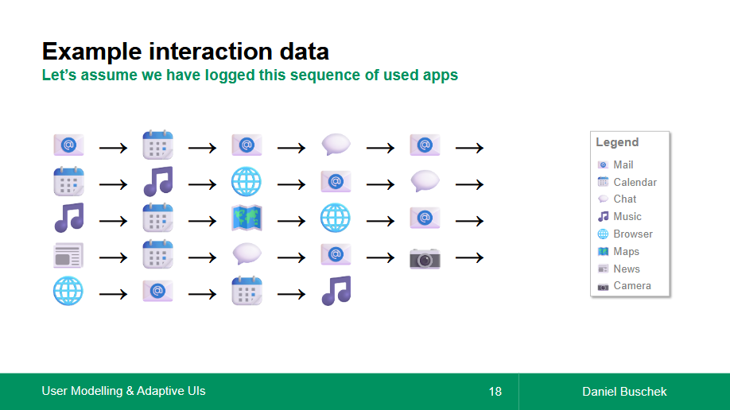
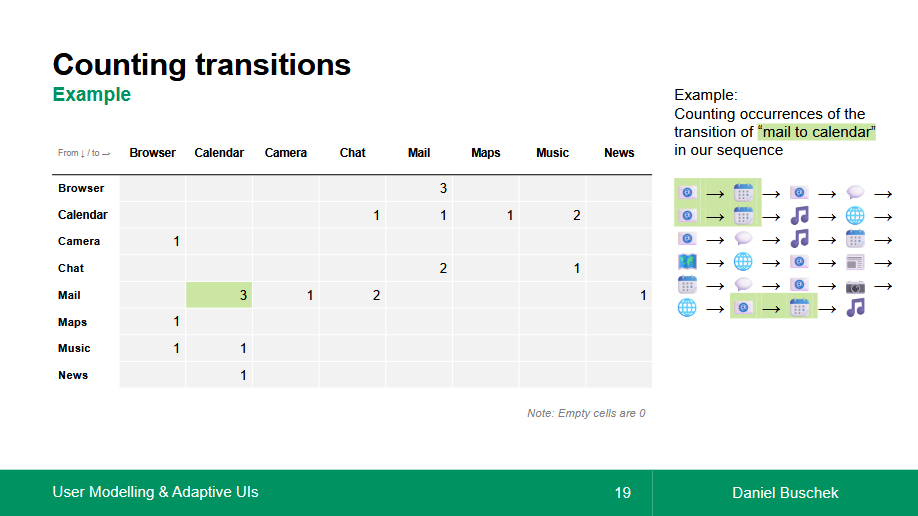
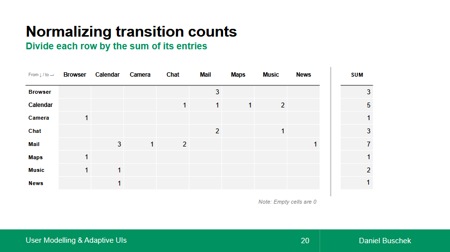
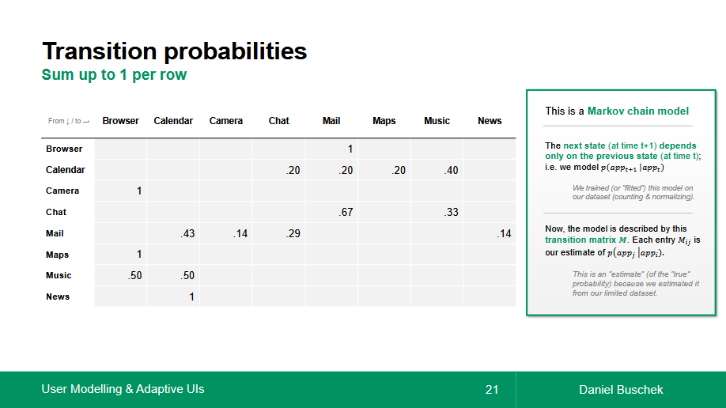

Result of MCM **help us to predict the next app** based on the previous app usage:  
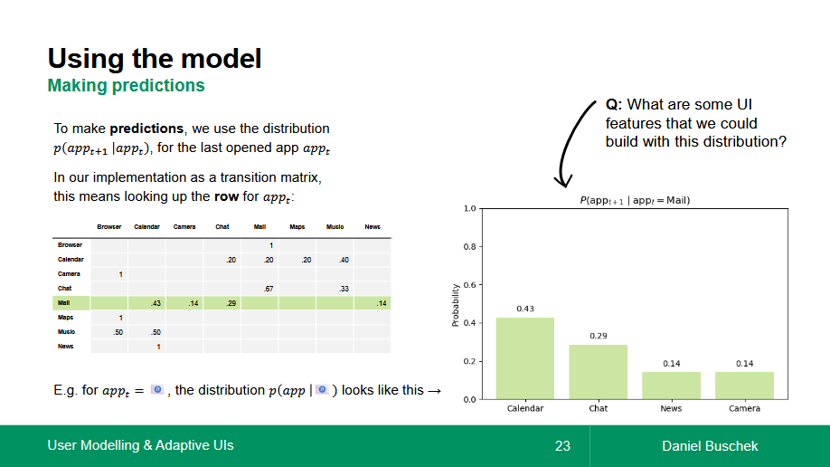

The model **can be extended** by considering **time of day** (day vs. night). Based on the previous app usage and the time of day, we can predict the next app usage:
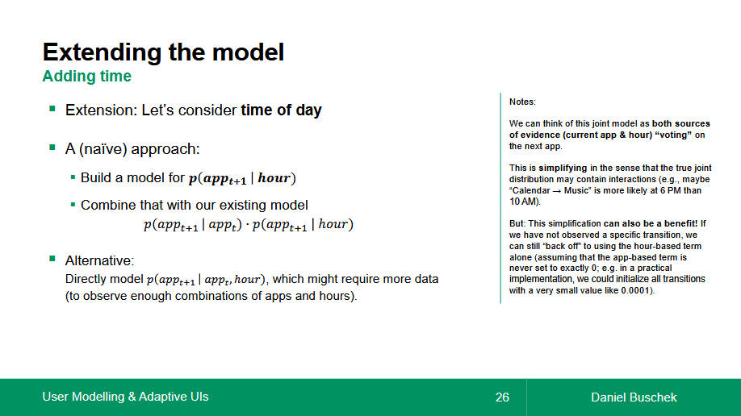

</details>

<details><summary>Modelling grid search/selection</summary>

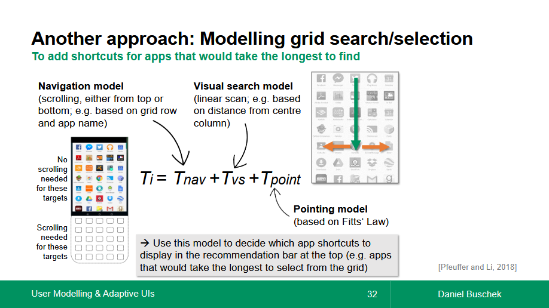

Predicts the time to find and select an app in a grid layout:

**Ti = Tnav + Tvs + Tpoint**

- **Tnav** — scrolling time (if app is outside visible area)
- **Tvs** — visual search time (linear scan)
- **Tpoint** — tap time (based on Fitts' Law)

**Application:** used to decide which apps to show as shortcuts in the top recommendation bar — apps with the highest Ti (longest to find in the grid) are prioritized.
</details>

#### Case study 2: Fitts’ Law (Time)
How long does it take to select an item?

<details><summary>Fitts’ Law</summary>

is a **model** of human movement (depeding on distance and size of the target) that **predicts the time required to move to a target area**.

**Trends:**
- Larger target → faster
- Longer distance → slower

**Formel:**
```
Movement Time = a + b * log2(2D/W)
```
D - distance to target (cm)  
W - size of target (cm)  
a, b - constants (sec)

</details>

#### Case study 2: Touch offsets (Space)
How do users touch a target on a touchscreen? How can we improve accuracy?

<details><summary>Touch offsets</summary>

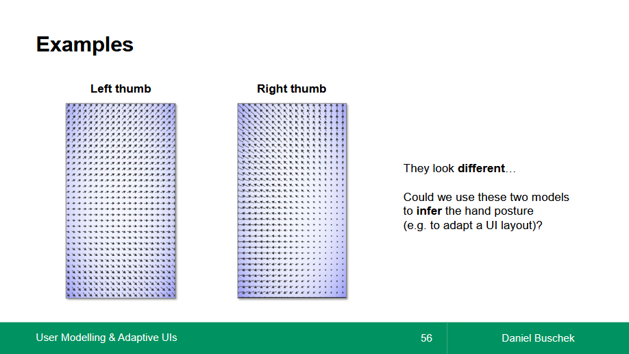
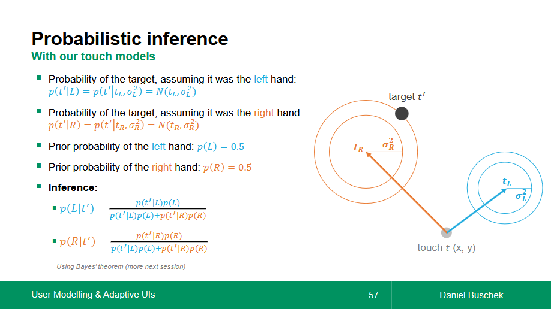

</details>

## 9.[Optimization](./lecture/iui_lecture_09_optimization.pdf)

<details><summary>Idea and motivation of using optimisation</summary>

- **Design space**: all possible UI designs (e.g., 26! possible key layouts)
- **Objective function**: a formula scoring the quality of a design (e.g. Fitts' Law)
- **Optimizer**: the algorithm that searches the design space for the best design (Simulated Annealing, Integer Programming, etc.)

</details>

<details><summary>Optimizer</summary>

**Path**:
1. Generate random design
2. Evaluate
3. Keep it if its better than the previous best design
4. Repeat

**Methods**:
- **Heuristic methods** (e.g. simulated annealing): flexible, but may not find the best solution
- **Exact methods** (e.g. integer programming): guaranteed to find the best solution, but may be slow for large design spaces

**Reflection and limitations**:
- Building the right thing or building the thing right?
- No single best design for all users

</details>